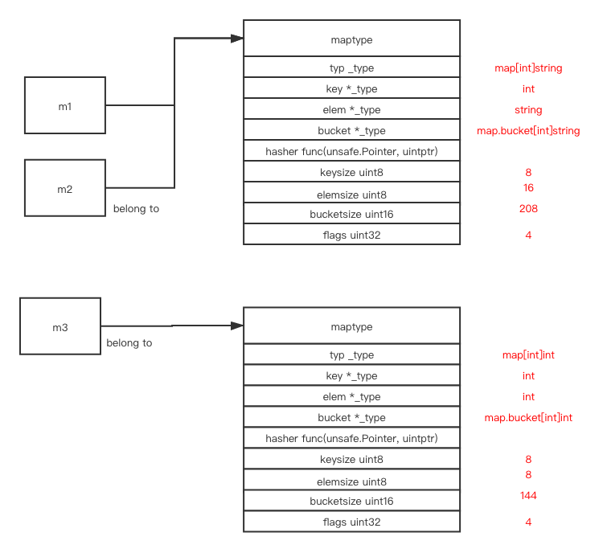
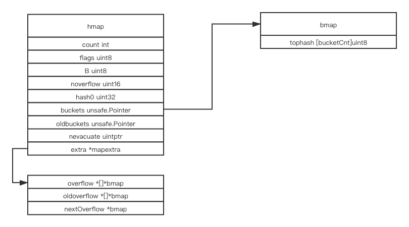

# map 

# contents

[related file](#related-file)

[memory layout](#memory-layout)

[insert](#insert)

# related file

* src/runtime/map.go
* src/runtime/map_fast32.go
* src/runtime/map_fast64.go
* src/runtime/map_faststr.go
* src/runtime/type.go

# memory layout

There exists various different version of map implementation

```shell
example % cat my_dict.go
```

```go
package main

import "fmt"

func main() {
        m1 := make(map[int]string)
        for i := 0; i < 2; i++ {
                m1[i] = "aaa"
        }
        m1[300] = "aaa"
        m1[400] = "bbb"
        m2 := make(map[int]string)
        m2[300] = "ccc"
        m3 := make(map[int]int)
        m3[300] = 500
}
```

m1, m2 shares the same `maptype`, while m3 is of different `maptype`, the `maptype` is not attached to any of the instance, compiler already knows the type of instance when you declare it and `maptype` is stored as hint in the runtime system



This is the layout of `hmap`



# insert

```go
func main() {
	m1 := make(map[int]string)
	m1[300] = "aaa"
}
```

