# map

## contents

[related file](#related-file)

[memory layout](#memory-layout)

[introduce](#introduce)

[buckets](#buckets)

* [tophash](#tophash)
* [key and element](#key-and-element)
* [insert](#insert)

[resize](#resize)

* [hashGrow](#hashGrow)
* [growWork](#growWork)

[overflow bucket](#overflow-bucket)

[delete](#delete)

[concurrency](#concurrency)

[read more](#read-more)


## related file

* src/runtime/map.go
* src/runtime/map_fast32.go
* src/runtime/map_fast64.go
* src/runtime/map_faststr.go
* src/runtime/type.go

## memory layout

There exists various different version of map implementation

```shell
example % cat my_dict.go
```

```go
package main

import "fmt"

func main() {
        m1 := make(map[int]string)
        for i := 0; i < 2; i++ {
                m1[i] = "aaa"
        }
        m1[300] = "aaa"
        m1[400] = "bbb"
        m2 := make(map[int]string)
        m2[300] = "ccc"
        m3 := make(map[int]int)
        m3[300] = 500
}
```

m1, m2 shares the same `maptype`, while m3 is of different `maptype`, the `maptype` is not attached to any of the instance, compiler already knows the type of instance when you declare it and `maptype` is stored as hint in the runtime system


This is the layout of `hmap`


## introduce

```go
func main() {
	m1 := make(map[int]string)
	m1[300] = "aaa"
}
```

`B` stores log2 of buckets num, you can get the total bucket count by `1 << B`, The initial value of `B` is 0, means there's only 1 bucket

When you access an element, the hash function attached to the `maptype` will be called, the hash result ` & bucketMask` will locate a bucket

```go
hash := t.hasher(noescape(unsafe.Pointer(&key)), uintptr(h.hash0))
bucket := hash & bucketMask(h.B)
```

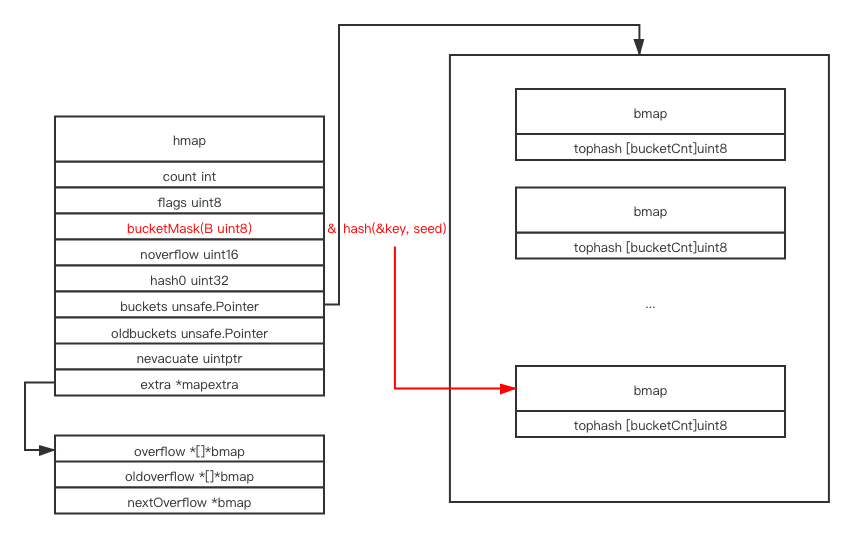

This is our example

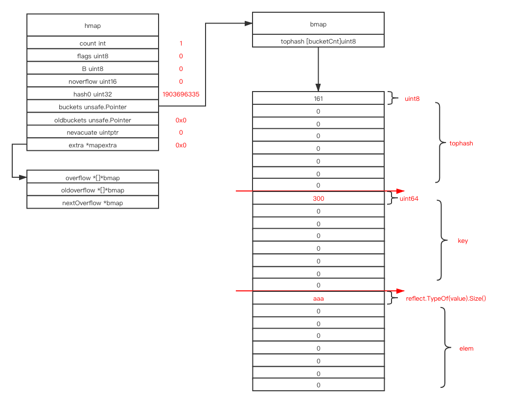

We can find that `count` stores how many elements currently stored inside the `map` so that `len(m1)` can be calculated in `O(1)` 

`flags` is used for indicating the state of current map

```go
iterator     = 1 // there may be an iterator using buckets
oldIterator  = 2 // there may be an iterator using oldbuckets
hashWriting  = 4 // a goroutine is writing to the map
sameSizeGrow = 8 // the current map growth is to a new map of the same size
```

`B` is bucket count in log2 format

`noverflow # TO DO`

`buckets` is a pointer which points to the head of current buckets

`nevacuate # TO DO`

`extra # TO DO`

## buckets

buckets is the actual memory container that stores the **key** and **value**, the **hash** function take the **key** and a **hash seed** and locate a bucket, and the **hash** part is done

The next step is linear search, traverse the bucket and find an entry which is currently avaliable, take it

If the current bucket is full, the linear search algorithm will cross the bucket boundary to the next [overflow bucket](#overflow-bucket), and repeat the searching process

### tophash

> tophash generally contains the top byte of the hash value for each key in this bucket. If tophash[0] < minTopHash,tophash[0] is a bucket evacuation state instead.

It can be used for cache and mark, you can traverse the `tophash` field one byte at a time, to get the state of the current hash slot

```go
/*
emptyRest      = 0 // this cell is empty, and there are no more non-empty cells at higher indexes or overflows.
emptyOne       = 1 // this cell is empty
evacuatedX     = 2 // key/elem is valid.  Entry has been evacuated to first half of larger table.
evacuatedY     = 3 // same as above, but evacuated to second half of larger table.
evacuatedEmpty = 4 // cell is empty, bucket is evacuated.
minTopHash     = 5 // minimum tophash for a normal filled cell.
*/
```

### key and element

the key and element are stored separately, offset is added to get the accurate address of the result

```go
// 8 for int64, uintptr(t.keysize) for usual case
k := *((*uint64)(add(unsafe.Pointer(b), dataOffset+i*8)))
elem := add(unsafe.Pointer(insertb), dataOffset+bucketCnt*8+inserti*uintptr(t.elemsize))
```

The purpose is to avoid alignment when you pack key and element with different size together, which saves memory usage

## insert

```go
m1 := make(map[int]string)
m1[1] = "aaa"
m1[3] = "ccc"
m1[6] = "fff"
m1[4] = "ddd"
```

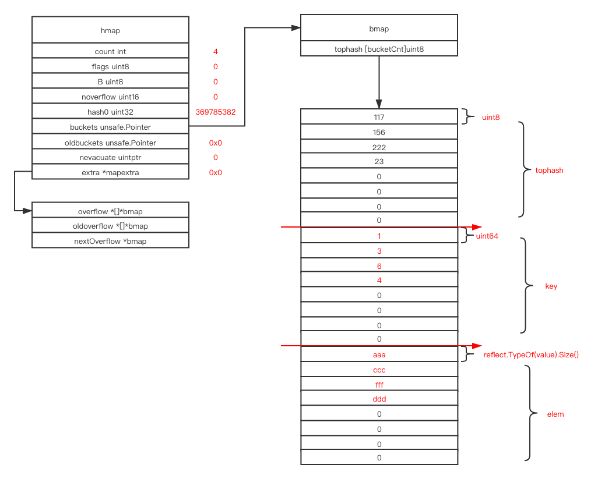

The bucket is seperated to three region, same index among different region group together can represent a hash slot(`tophash[0] - key[0] - elem[0] ===> 1: "aaa"`)

```go
m1[2] = "bbb"
m1[5] = "eee"
m1[8] = "hhh"
m1[7] = "ggg"
```

The key and value inserted in the same bucket are stored in insertion order

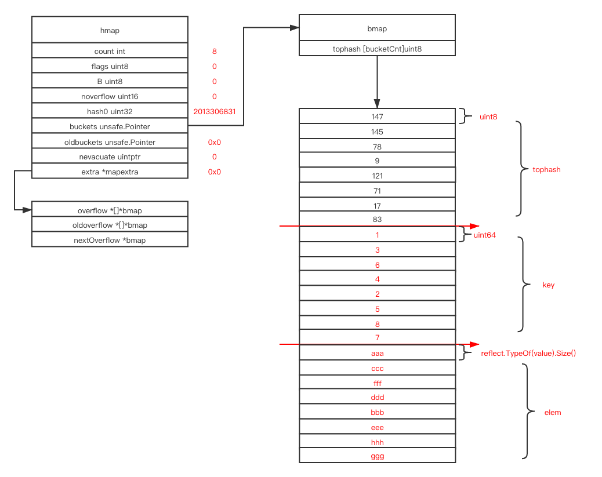

## resize

```go
m1[9] = "iii"
```

### hashGrow

When there're no enough entry left in the following buckets and element count in the map achieve the load factor `hashGrow` function will be called when you try to insert another element

`hashGrow` doubles the size of buckets if meet the following condition `(count > 6.5 * B)`

```go
func overLoadFactor(count int, B uint8) bool {
   return count > bucketCnt && uintptr(count) > loadFactorNum*(bucketShift(B)/loadFactorDen)
}
```

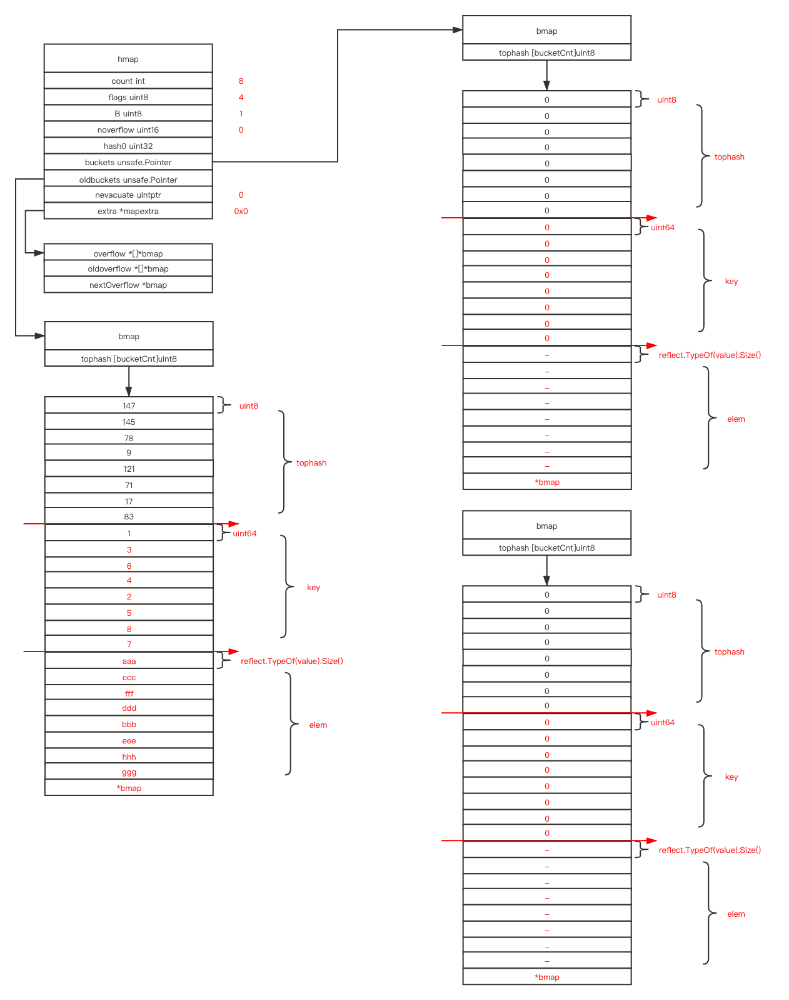

after malloc a new bucket array from go's memory management system, and set the `buckets` pointer points to the newly malloced address, set the `oldbuckets` points to the original buckets array, `hashGrow`'s work is done

### growWork

In every assign and delete operation, it will checks whether the `rehash` is done, if not the `growWork` will be called, `growWork` will do a small step of real rehash operation, by amortizing the `rehash` operation,  `resize` only needs to malloc a new bucket array which makes the resize very efficent, The strategy's name is [incremental resizing](https://en.wikipedia.org/wiki/Hash_table#Incremental_resizing) which is also used in [Redis hash implementation](https://github.com/zpoint/Redis-Internals/blob/5.0/Object/hash/hash.md#resize) 

The current go runtime map calls `growWork` on every `assign` and `delete` operation, `growWork` will rehash the current bucket and the next top bucket, so each `assign` or `delete` operation will cause two buckets to be rehashed

For example

```go
func main() {
	m1 := make(map[int]string)
	for i := 0; i < 26; i++ {
		m1[i] = string(i)
	}
	fmt.Println("\n\n\nbr1\n\n\n")
	m1[27] = "27"
	fmt.Println("\n\n\nbr2\n\n\n")
	m1[27] = "28"
	fmt.Println("\n\n\nbr3\n\n\n")
	m1[27] = "29"
}
```

The layout in `br1`

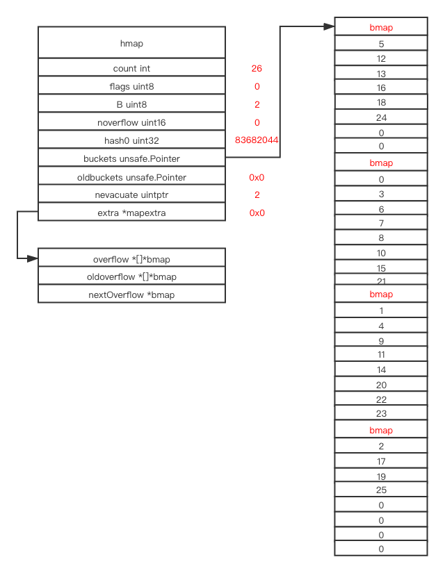

The assign operation `m1[27] = "27"` will do the following steps

Malloc an array of buckets which is double size of the origin bucket array, and set the current `buckets` pointer points to the new bucket array,  the `oldbuckets` pointer points to the origin bucket array

`B` becomes 3

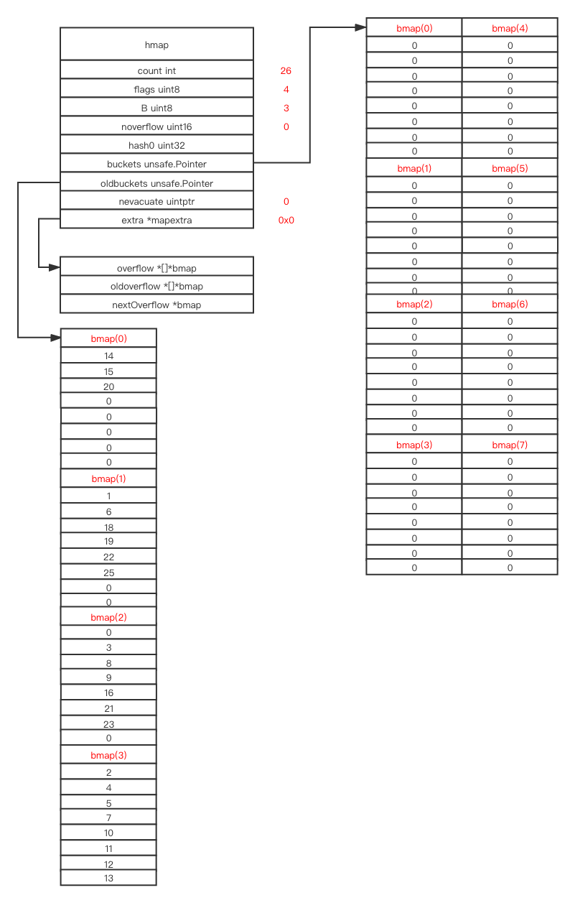


Because the next key `27` 's hash result is in`bucket 3`, the `bucket 3` will be rehashed firstly

The reset constant `evacuatedX` means

>  key/elem is valid.  Entry has been evacuated to first half of larger table.

`evacuatedY`  means

> same as above, but evacuated to second half of larger table.

`evacuatedEmpty` means

> cell is empty, bucket is evacuated.

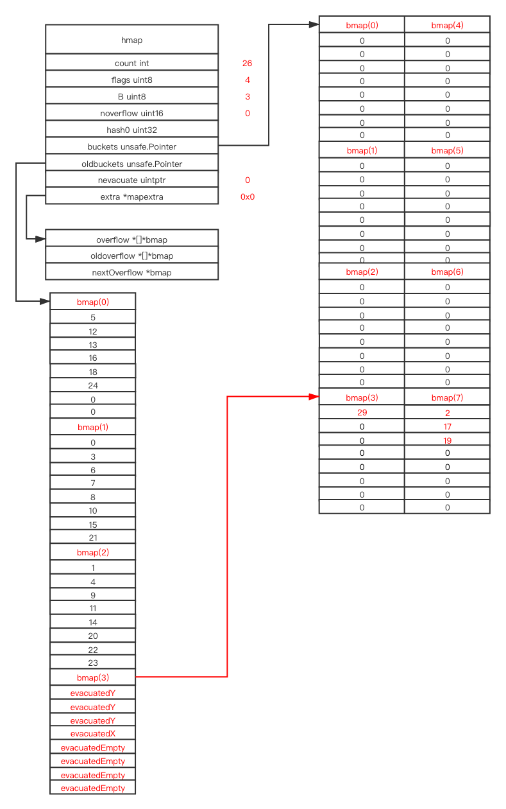

The next top bucket `oldbuckets` pointer points to will be the next target to be rehashed

Also key `27` will be inserted

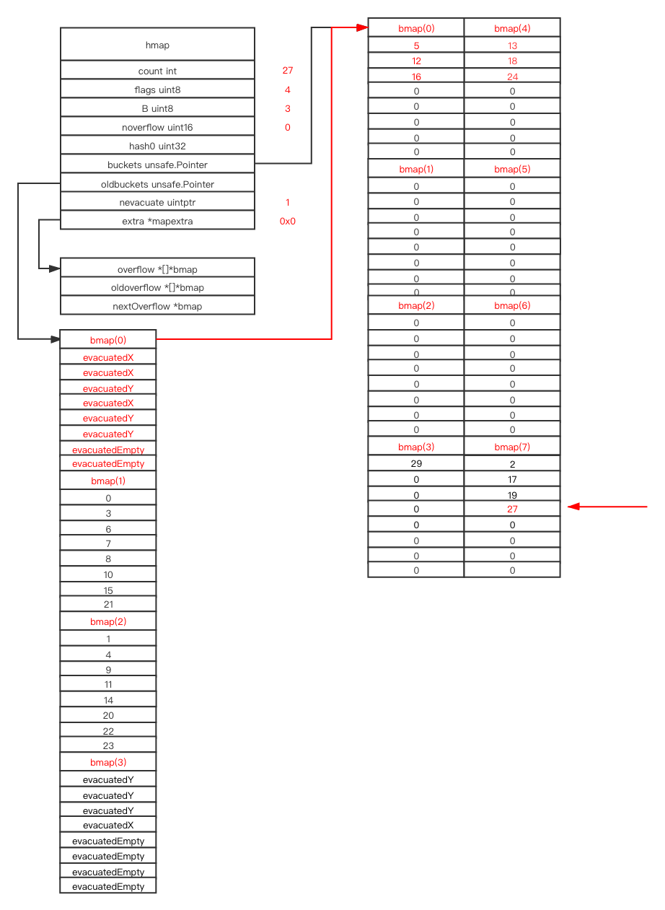

And `br2` is done, `growWork` will only rehash two buckets each time

If we assign `m1` one more time, after `br2` before `br3`

Because the inserted key's hash value is located in old `bmap(3)` and old `bmap(3)` is already rehashed, we will only rehash the next top unevacuted bucket in `oldbuckets`

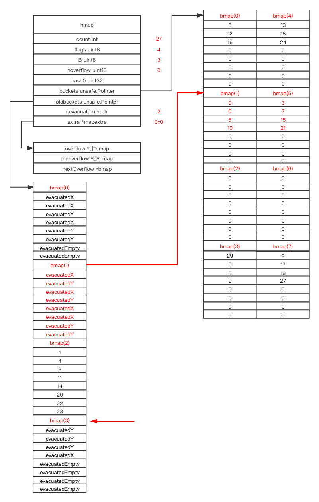

So does the assignment after `br3`

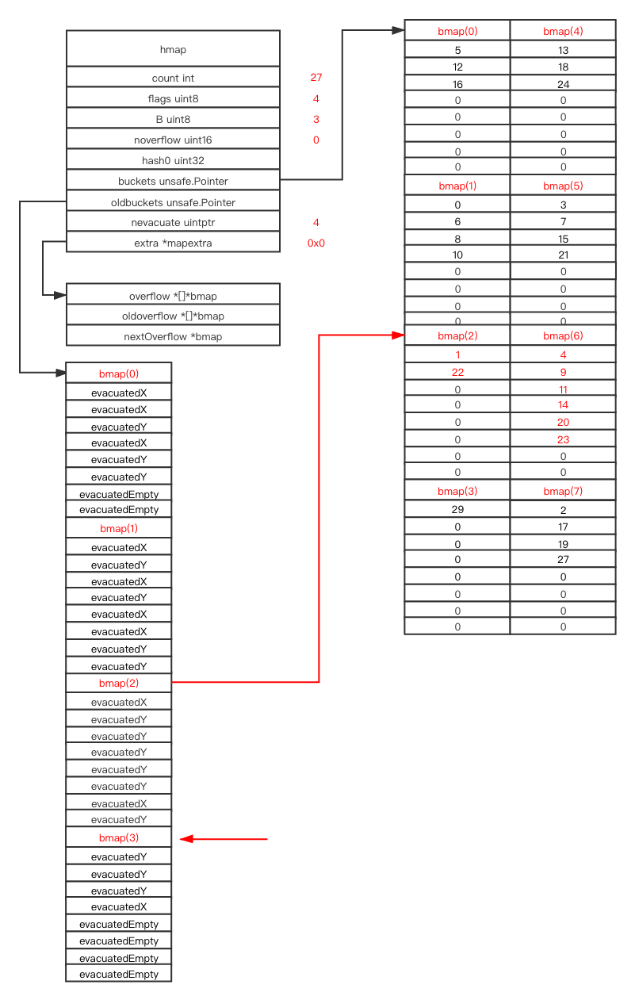

Because after the assignment after `br3`, all buckets in `oldbuckets` are evacuted, the whole rehash procedure is done


## overflow bucket


## delete

##concurrency


## read more

* [macro view of map internals in go](https://www.ardanlabs.com/blog/2013/12/macro-view-of-map-internals-in-go.html)