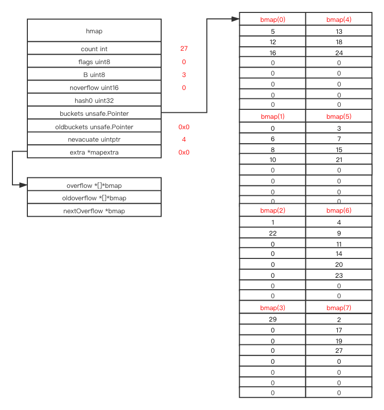
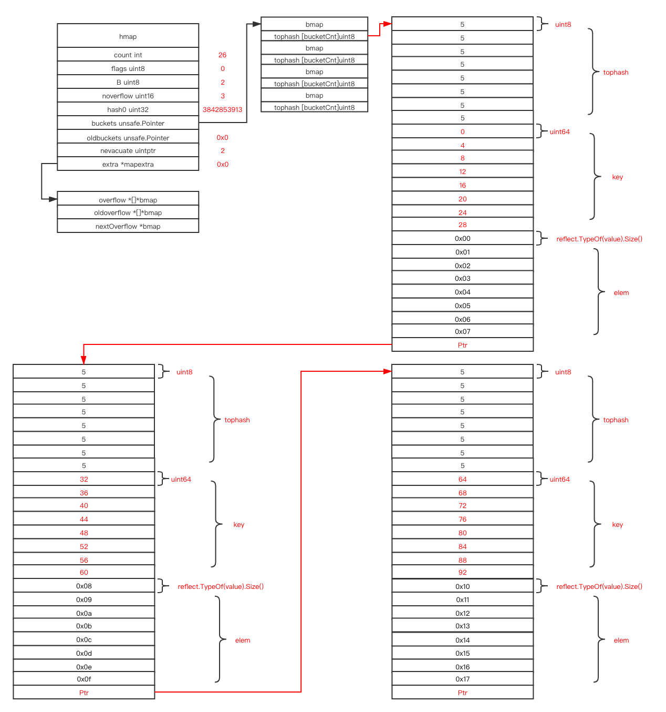
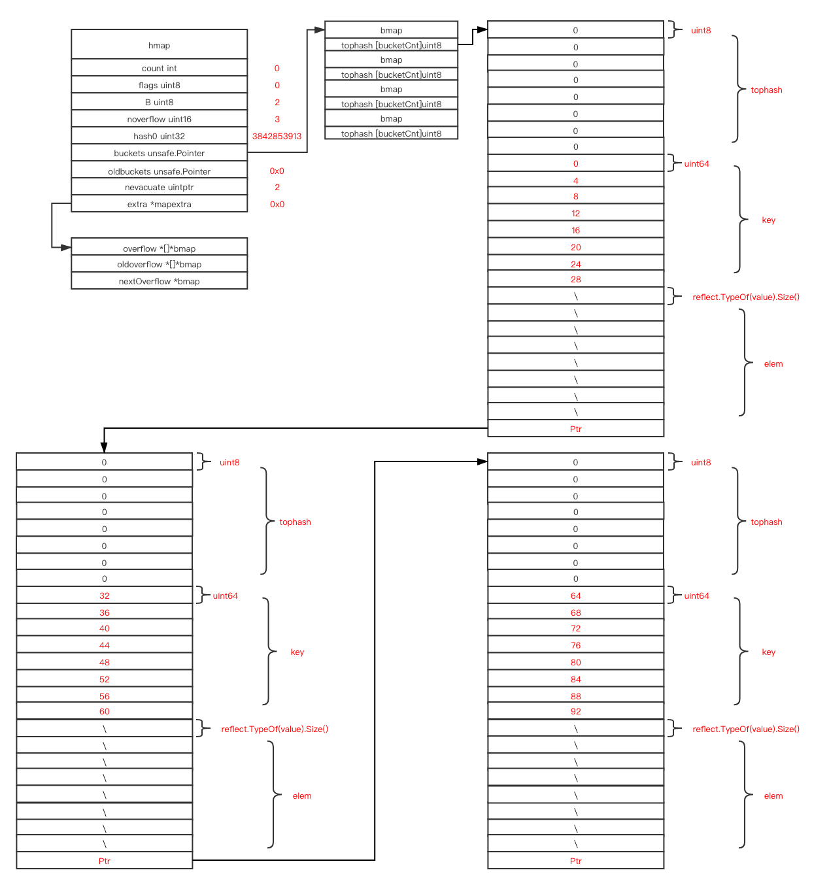

# map

## 目录

[相关位置文件](#相关位置文件)

[内存构造](#内存构造)

[介绍](#介绍)

[桶](#桶)

* [tophash](#tophash)
* [键和值](#键和值)
* [插入](#插入)

[resize](#resize)

* [hashGrow](#hashGrow)
* [growWork](#growWork)

[overflow bucket](#overflow-bucket)

[删除操作](#删除操作)

[并发](#并发)

[更多资料](#更多资料)


## 相关位置文件

* src/runtime/map.go
* src/runtime/map_fast32.go
* src/runtime/map_fast64.go
* src/runtime/map_faststr.go
* src/runtime/type.go

## 内存构造

map 类型的实现根据键的类型不同而有细微的差异, 总体上是相同的

```shell
example % cat my_dict.go
```

```go
package main

import "fmt"

func main() {
        m1 := make(map[int]string)
        for i := 0; i < 2; i++ {
                m1[i] = "aaa"
        }
        m1[300] = "aaa"
        m1[400] = "bbb"
        m2 := make(map[int]string)
        m2[300] = "ccc"
        m3 := make(map[int]int)
        m3[300] = 500
}
```

m1, m2 拥有相同的 `maptype`, m3 则是另一个不同的 `maptype`, `maptype` 不会和任意一个实例进行绑定, 在你进行变量声明的时候, 编译器已经知道了实例对应的类型, `maptype` 只在运行时起辅助作用


这是 `hmap `的构造


## 介绍

```go
func main() {
	m1 := make(map[int]string)
	m1[300] = "aaa"
}
```

`B` 存储的是桶的数量的 log2 之后的值, 通过 `1 << B` 就可以得到初始桶的数量, `B` 的初始值是 0, 表示只有1个桶

当你访问一个元素时, `maptype`  上绑定的哈希函数会被调用, 哈希结果  ` & bucketMask` (取低位) 之后的就能定位到一个桶

```go
hash := t.hasher(noescape(unsafe.Pointer(&key)), uintptr(h.hash0))
bucket := hash & bucketMask(h.B)
```


这是我们的示例


我们可以发现 `count` 表示当前有 `map` 中有多少个元素, 通过这个值, `len(m1)` 可以在  `O(1)`  的时间复杂度返回结果

`flags` 被用来表示当前 map 的一些状态

```go
iterator     = 1 // 当前有一个迭代器正在遍历 buckets 
oldIterator  = 2 // 当前有一个迭代器正在遍历 oldbuckets
hashWriting  = 4 // 当前有一个 goroutine 正在对 map 进行写入
sameSizeGrow = 8 // 桶内元素已经满了, 需要调用 hashGrow 变大, 但是还没达到阈值, 用链表的方式变大
```

`B` 表示 log2 之后的桶的数量

`noverflow` 表示我们当前有多少个 [overflow buckets](#overflow-bucket) 

`buckets` 是一个指针指向桶数组开始的位置

`nevacuate` 表示在 [resize](#resize) 的过程中有多少桶已经被 rehash 了

## 桶

桶才是内存中真正存储键和值的容器, 哈希函数拿到键, 取键的地址和一个哈希种子得到一个桶的位置, 之后哈希就结束了

接下来是线性搜索, 遍历整个桶并找到第一个空闲的位置, 占用他

如果当前的哈希桶是满的, 则会通过链表指针到达下一个 [overflow bucket](#overflow-bucket) 中, 并重复上述搜索过程

### tophash

> tophash 包含了桶中每个键的哈希值的第一个字节, 如果 tophash[0] < minTopHash, 则表示 tophash[0]  处于已经被 rehash 转移的状态

这个值被用作标记和缓存, 比如你逐字节遍历 `tophash` 就能得到当前对应的每个桶中不同位置的状态

```go
/*
emptyRest      = 0 // 这个单元是空的, 并且更高位的单元也不存在非空的键
emptyOne       = 1 // 这个单元是空的
evacuatedX     = 2 // 键/值是合法的, 但是已经被 rehash 到新的桶数组的前半部分
evacuatedY     = 3 // 和上一种情况相同, 但是被 rehash 到新的桶数组的后半部分
evacuatedEmpty = 4 // 这个单元是空的, 并且当前的桶已经被 rehash 完了
minTopHash     = 5 // 最小标记位表示当前的单元是否一个普通的数据
*/
```

### 键和值

键和值是分开存储的, 通过指针位移来获得需要的值的位置

```go
// int64 位移量是 8, 其他的通常的情况是 uintptr(t.keysize)
k := *((*uint64)(add(unsafe.Pointer(b), dataOffset+i*8)))
elem := add(unsafe.Pointer(insertb), dataOffset+bucketCnt*8+inserti*uintptr(t.elemsize))
```

把键和值分开存储是为了避免当你存在一起并键和值的大小不相同时, 每一组都需要对齐内存浪费额外的空间

## 插入

```go
m1 := make(map[int]string)
m1[1] = "aaa"
m1[3] = "ccc"
m1[6] = "fff"
m1[4] = "ddd"
```


一个桶被分成了三部分(实际上尾部还有一个指针), 一个桶中三部分同个索引下标组合起来可以表示一组键对值(`tophash[0] - key[0] - elem[0] ===> 1: "aaa"`)

```go
m1[2] = "bbb"
m1[5] = "eee"
m1[8] = "hhh"
m1[7] = "ggg"
```

在同一个桶中插入的键和值排序是按照插入的顺序排序的


## resize

```go
m1[9] = "iii"
```

### hashGrow

当当前的桶没有足够的剩余空间, 并且 map 中的元素数量达到了平衡阈值时, 此时你再次插入一个元素时, `hashGrow` 函数会被调用

`hashGrow` 会在满足如下条件的情况下创建一个两倍于原来大小的桶数组 `(count > 6.5 * B)`

```go
func overLoadFactor(count int, B uint8) bool {
   return count > bucketCnt && uintptr(count) > loadFactorNum*(bucketShift(B)/loadFactorDen)
}
```


在和内存管理系统申请到了一个新的桶数组之后, 把 `buckets` 指针指向新申请的数组头部, 并且把 `oldbuckets` 指向原本的 `buckets` 数组,  `hashGrow` 的工作就完成了

### growWork

在每一次赋值和删除操作时, map 会检查当前的 `rehash` 是否已经完成, 如果没有的话, `growWork` 会被调用, `growWork` 在每次调时会做一小部分 `rehash` 操作, 把 `rehash` 操作分摊到后面的每次修改中, 扩容时只需要申请一个新的桶数组即可, 这样可以保持扩容时的高效, 这个策略叫做 

In every assign and delete operation, it will checks whether the `rehash` is done, if not the `growWork` will be called, `growWork` will do a small step of real rehash operation, by amortizing the `rehash` operation,  `resize` only needs to malloc a new bucket array which makes the resize very efficent, The strategy's name is [渐进式扩容](https://en.wikipedia.org/wiki/Hash_table#Incremental_resizing) 并且 [Redis hash 实现](https://github.com/zpoint/Redis-Internals/blob/5.0/Object/hash/hash_cn.md#resize) 中也同样使用了这个策略

当前的 go 运行时会在每次 `assign` 和 `delete` 操作时调用 `growWork`, `growWork` 会 rehash 当前需要用到的桶和下一个旧的桶数组中头部的桶, 所以每一次 `assign` 和 `delete` 操作都会触发 2 个桶的 rehash

我们来看下面的示例

```go
func main() {
	m1 := make(map[int]string)
	for i := 0; i < 26; i++ {
		m1[i] = string(i)
	}
	fmt.Println("\n\n\nbr1\n\n\n")
	m1[27] = "27"
	fmt.Println("\n\n\nbr2\n\n\n")
	m1[27] = "28"
	fmt.Println("\n\n\nbr3\n\n\n")
	m1[27] = "29"
}
```

 `br1` 打印出来时的构造如下


 `m1[27] = "27"`  这一个赋值语句会进行如下操作

申请一个两倍原桶数组大小的新数组, 并且把当前的 `buckets` 指针指向新申请的数组, `oldbuckets` 指针指向原本的数组

`B` 变成了 3


接下来要插入的键 `27`的哈希结果在 `bucket 3` 上, `bucket 3` 会首先被 rehash

被重置后的 `evacuatedX` 表示

>  键/值是合法的, 但是已经被 rehash 到新的桶数组的前半部分

`evacuatedY`  表示

> 键/值是合法的, 但是已经被 rehash 到新的桶数组的前半部分

`evacuatedEmpty` 表示

> 这个单元是空的, 并且当前的桶已经被 rehash 完了


下一个`oldbuckets`指向的头部的桶也会被 rehash

并且键 `27` 也会插入到对应位置


在 `br2`打印出来时, `growWork` 只完成了 2 个桶的 rehash

如果我们对 `m1` 在进行一个赋值操作, 在 `br2` 之后并且在 `br3`之前

因为新插入的键对应的哈希值的位置还是在旧的 `bmap(3)` 中, 并且旧的 `bmap(3)`  已经被 rehash 了, 我们只会对`oldbuckets` 指向的下一个未弹出的桶进行 rehash


在 `br3 `之后的赋值语句也进行了同样的操作


在 `br3` 赋值完成之后, `oldbuckets` 中所有的桶都转移完成了, `oldbuckets` 指针会被重置并且 `oldbuckets` 数据会交给 gc 处理

在此之后, 整个 rehash 就完成了



## overflow bucket

桶的大小是编译时确定的一个常量(默认是8), 如果有超过 8 个键都被哈希到了同一个桶上呢?

```go
func main() {
   m1 := make(map[int]string)
   for i := 0; i < 26; i++ {
      m1[i*4] = string(i)
   }
}
```

为了更好的演示, 我修改了源代码让哈希函数直接以键里的整数值作为哈希结果, 而不是取键的地址和一个哈希种子运算后得出结果



我们可以发现, 当桶满时, 并且还有需要插入到同个桶中的键, 桶尾部存储的指针则会指向一个新申请的新的桶

这个新的桶地址和原本的桶的地址不是连续的, 所以这里变成了一个链表

实际上的键是通过键的地址和一个哈希种子运算得出的, 真实情况下很难得出一个如上所示的链表化的`map`

## 删除

当你从 `map` 中删除一个元素时,  `bucket[hash].tophash[i]` 中的标记位会被设置为 `emptyRest/emptyOne`, 下一个插入的元素可以重新使用这个位置

```go
for i := 0; i < 26; i++ {
   delete(m1, i*4)
}
```



`tophash` 会被重置为一个表示为空的标记位

因为 `int` 是一种特殊的键值, 它是以原本的值的方式直接存储在 `key` 数组上的, `string` 则是以指针的方式存储在 `elem` 上

`key` 不需要处理, 下个插入操作会进行覆盖

`elem` 指针则会被重置,  gc 会负责清理这部分对象

## 并发

有一个标记值 `hashWriting` 表示

> 当前是否有一个 goroutine 正在对 map 进行写入

在赋值和删除操作中, 这个标记会被打开(同时在设置前也会检查这个标记) 

在获取 `map` 中的元素时, 是会检查当前这个标记的

```go
if h.flags&hashWriting != 0 {
   throw("concurrent map read and map write")
}
```

因为 获取 `map` 中的元素时并不会改变任何对象, 所以并发的读取操作是可以的, 但是并发的读写或者并发的写入是不允许的, 你可能在读取或者修改另一个 `goroutine` 修改到一半的 `map`

为了支持并发的读取, [渐进式扩容](https://en.wikipedia.org/wiki/Hash_table#Incremental_resizing) 并没有在获取 `map` 中的元素中实现对应的转移操作, 而 [Redis hash](https://github.com/zpoint/Redis-Internals/blob/5.0/Object/hash_cn/hash.md#resize) 中则在读取元素中实现了元素的转移, [Redis](https://github.com/zpoint/Redis-Internals/blob/5.0/Object/hash/hash_cn.md#resize) 只存在一个事件循环会对对应的数据结构进行修改, 不存在并发操作的问题

如果你有并发修改 `map` 的需求, 请参考 [sync.map](https://golang.org/pkg/sync/#Map)

## 更多资料

* [macro view of map internals in go](https://www.ardanlabs.com/blog/2013/12/macro-view-of-map-internals-in-go.html)

