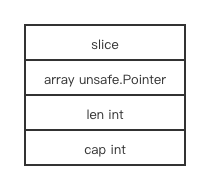
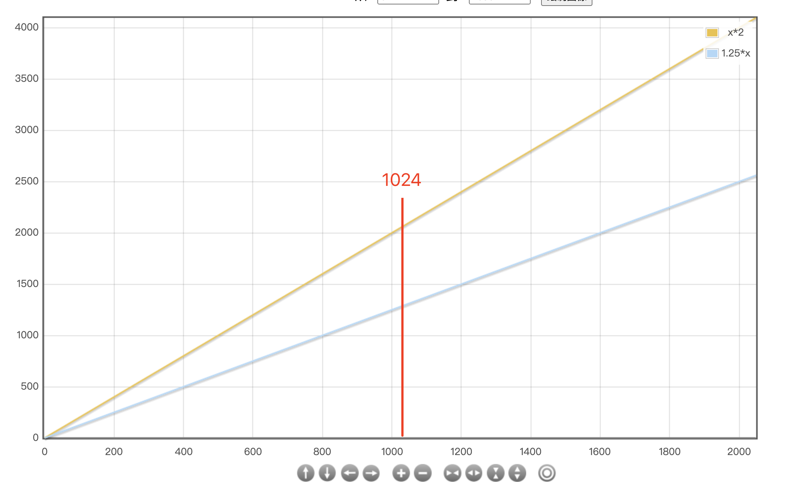
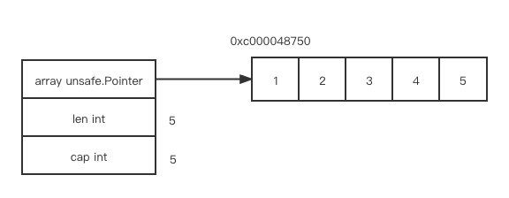
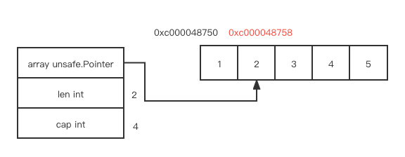

# slice

## 目录

[related file](#related-file)

[memory layout](#memory-layout)

[makeslice](#makeslice)

[growslice](#growslice)

[slice](#slice)

## 相关位置文件

* src/runtime/slice.go

## 内存构造

slice 结构的内存构造比较简洁

`array` 指向数据部分的开始位置

`len` 是`slice` 当前存储的元素个数

`cap` 是 `array` 指向的空间实际申请的空间大小(能容纳多少个元素)




```go
package main

func main() {
	a := make([]int, 3)
	println(a)
}
```

如果你尝试编译上述代码 `go tool compile -S -N -l main.go`

编译生成SSA的代码在 [这里](https://github.com/golang/go/blob/go1.16.7/src/cmd/compile/internal/gc/ssa.go)

```shell
"".main STEXT size=123 args=0x0 locals=0x50 funcid=0x0
        0x0000 00000 (main.go:3)        TEXT    "".main(SB), ABIInternal, $80-0
        0x0000 00000 (main.go:3)        CMPQ    SP, 16(R14)
        0x0004 00004 (main.go:3)        PCDATA  $0, $-2
        0x0004 00004 (main.go:3)        JLS     116
        0x0006 00006 (main.go:3)        PCDATA  $0, $-1
        0x0006 00006 (main.go:3)        SUBQ    $80, SP
        0x000a 00010 (main.go:3)        MOVQ    BP, 72(SP)
        0x000f 00015 (main.go:3)        LEAQ    72(SP), BP
        0x0014 00020 (main.go:3)        FUNCDATA        $0, gclocals·69c1753bd5f81501d95132d08af04464(SB)
        0x0014 00020 (main.go:3)        FUNCDATA        $1, gclocals·713abd6cdf5e052e4dcd3eb297c82601(SB)
        0x0014 00020 (main.go:4)        MOVQ    $0, ""..autotmp_1+24(SP)
        0x001d 00029 (main.go:4)        LEAQ    ""..autotmp_1+32(SP), AX
        0x0022 00034 (main.go:4)        MOVUPS  X15, (AX)
        0x0026 00038 (main.go:4)        LEAQ    ""..autotmp_1+24(SP), AX
        0x002b 00043 (main.go:4)        TESTB   AL, (AX)
        0x002d 00045 (main.go:4)        JMP     47
        0x002f 00047 (main.go:4)        MOVQ    AX, "".a+48(SP)
        0x0034 00052 (main.go:4)        MOVQ    $3, "".a+56(SP)
        0x003d 00061 (main.go:4)        MOVQ    $3, "".a+64(SP)
.......
```

我们可以发现 go 编译器把 `a` 存储在了函数堆栈中, 而不是从 `heap` 中申请

我们把 `a` 改成更大的 `slice`

```go
package main

func main() {
	a := make([]int, 30000)
	println(a)
}
```

现在调用了 `runtime.makeslice` , `slice` 会从运行时的 `heap` 中申请空间

```shell
"".main STEXT size=118 args=0x0 locals=0x38 funcid=0x0
        0x0000 00000 (main.go:3)        TEXT    "".main(SB), ABIInternal, $56-0
        0x0000 00000 (main.go:3)        CMPQ    SP, 16(R14)
        0x0004 00004 (main.go:3)        PCDATA  $0, $-2
        0x0004 00004 (main.go:3)        JLS     111
        0x0006 00006 (main.go:3)        PCDATA  $0, $-1
        0x0006 00006 (main.go:3)        SUBQ    $56, SP
        0x000a 00010 (main.go:3)        MOVQ    BP, 48(SP)
        0x000f 00015 (main.go:3)        LEAQ    48(SP), BP
        0x0014 00020 (main.go:3)        FUNCDATA        $0, gclocals·69c1753bd5f81501d95132d08af04464(SB)
        0x0014 00020 (main.go:3)        FUNCDATA        $1, gclocals·713abd6cdf5e052e4dcd3eb297c82601(SB)
        0x0014 00020 (main.go:4)        LEAQ    type.int(SB), AX
        0x001b 00027 (main.go:4)        MOVL    $30000, BX
        0x0020 00032 (main.go:4)        MOVQ    BX, CX
        0x0023 00035 (main.go:4)        PCDATA  $1, $0
        0x0023 00035 (main.go:4)        CALL    runtime.makeslice(SB)
        0x0028 00040 (main.go:4)        MOVQ    AX, "".a+24(SP)
        0x002d 00045 (main.go:4)        MOVQ    $30000, "".a+32(SP)
        0x0036 00054 (main.go:4)        MOVQ    $30000, "".a+40(SP)

```

## makeslice

`makeslice` 根据当前 `slice`  的 `type` 大小, 和 `cap` 的值, 计算需要多少空间, 并调用 `mallocgc` 从运行时 `heap` 中申请空间, 在这之前会检查是否会造成溢出

```go
func makeslice(et *_type, len, cap int) unsafe.Pointer {
  mem, overflow := math.MulUintptr(et.size, uintptr(cap))
  // omit ...
	return mallocgc(mem, et, true)
}
```

## growslice

如果你调用了 `append`, 编译后会发现它最终调用了 `src/runtime/slice.go` 中的  `growslice` 方法

```go
a = append(a, 3)
```

空间的增加速率如下图所示



当 `cap`  小于 1024 时, `cap` 在每次增长时都空间翻倍, 符合黄线的速率

当 `cap` 大于等于 1024 时, `cap` 每次增长 `1/4`, 符合蓝线的增长速率

`growslice` 并不是每次调用 `append` 都会调用的, 你观察编译生成的代码会发现调用之前判断了 `cap` 和 `len`, 只有空间不足时才跳到`growslice` 的调用部分代码

## slice

```go
package main

func main() {
	a := []int{1,2,3,4,5}
	println(a, len(a), cap(a))
	a = a[1:3]
	println(a, len(a), cap(a))
}
```

观察上述代码的编译结果, 可以发现  `a.len` 的值和 `a.cap` 被重新调整了, 这里不涉及新的内存分配和释放

 

所以他们都指向同一个原始空间



