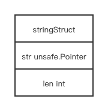
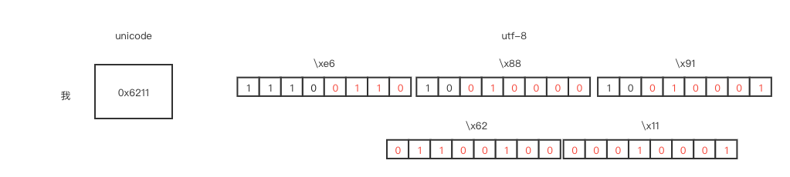

# string

## contents

[related file](#related-file)

[memory layout](#memory-layout)

[encoding](#encoding)

[read more](#read-more)

## related file

* src/runtime/string.go

## memory layout

The layout of `string` is quiet simple

`str` points to the beginning of the byte array

`len` stores the length of `string`



## encoding

```go
package main

import "strconv"

func main() {
	var s string = "我是"
	for pos, val := range s {
		println(pos, val, strconv.FormatInt(int64(val), 16))
	}
	println(len(s), &s)
}

```

The output is 

```shell
0 25105 6211
3 26159 662f
6 0xc000046768
```

> For strings, the range does more work for you, breaking out individual Unicode code points by parsing the UTF-8.

`0x6211` is the unicode of `我`

`0x662f` is the unicode of `是`

The `utf-8` representation of `我是` is `b'\xe6\x88\x91\xe6\x98\xaf'`

```go
package main

import (
	"strconv"
)

func main() {
	var s string = "我是"

	for pos, val := range []rune(s) {
		println(pos, strconv.FormatInt(int64(val), 16))
	}
	for pos, val := range []byte(s) {
		println(pos, strconv.FormatInt(int64(val), 16))
	}
}
```

The output is 

```shell
0 6211
1 662f
0 e6
1 88
2 91
3 e6
4 98
5 af
```

We can learn from the above code that `rune` will iterate over each `unicode` in the string

While `byte` will iterate over each `byte` in string

And the string is represented in `utf-8` format

The following diagram shows the relationship between `unicode` and `utf-8`

If we strip off the flag bit in `utf-8`  format, put the red bits together, we can restore the `unicode` representation

For those who are not familiar with `utf-8`, When we scan the first byte, we can count how many continuous `1` in the first bytes before the first `0` to know the number of bytes used for the current unicode character, It's 3 in the example, so there're 3 bytes totally, and the rest `bits` stores message we need 

If it's not the first byte, it will start with `10`, so the next two bytes, exclude the first two bits in each byte, we get the message we need

Put together is our unicode character

And repeat scan until the end



## read more

[Strings In Go's Runtime](https://boakye.yiadom.org/go/strings/)

