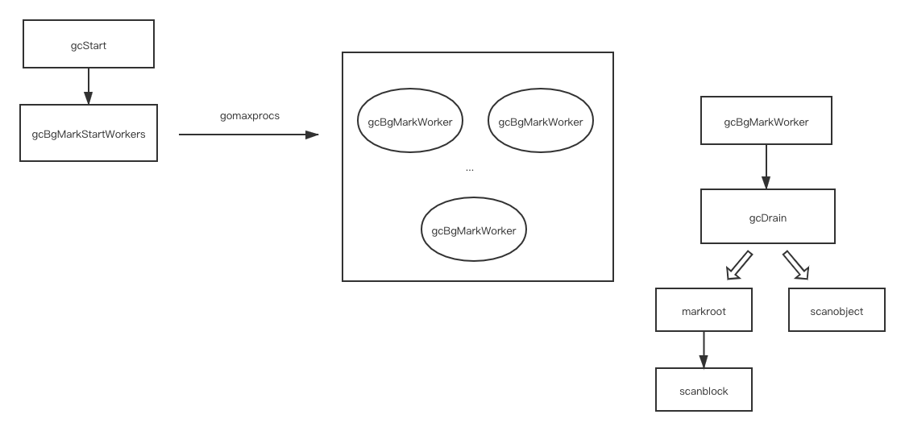
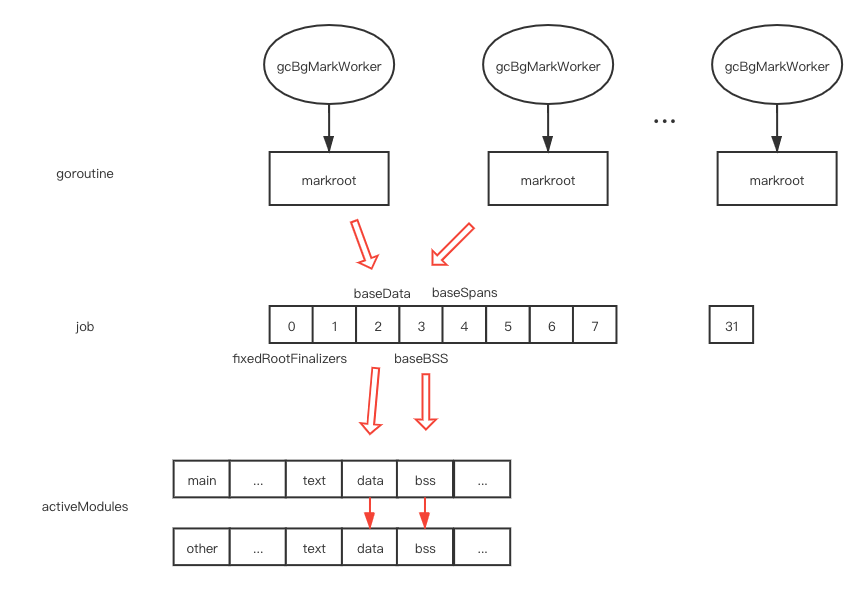
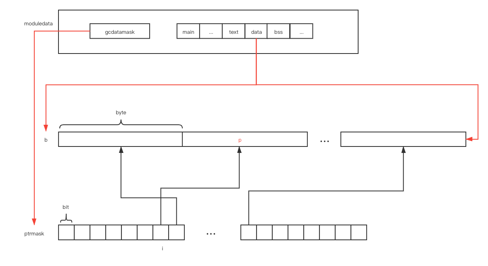
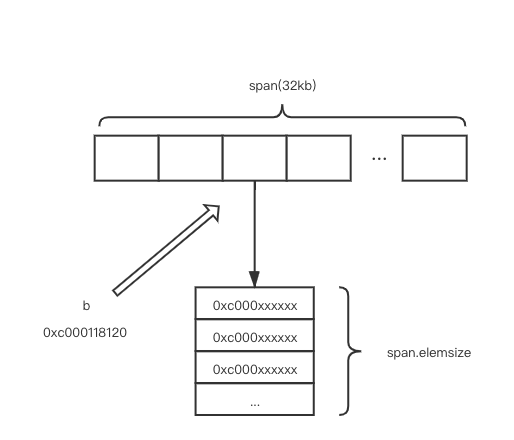

# gc

# contents

[related file](#related-file)

[overview](#overview)

[when gc starts](#when-gc-starts)

[how gc works](#how-gc-works)

* [markroot](#markroot)
* [scanblock](#scanblock)
* [scanobject](#scanobject)

[read more](#read-more)

# related file

* src/runtime/mgc.go
* src/runtime/malloc.go
* src/runtime/mgcmark.go
* src/runtime/mbitmap.go

## overview

This article focus on the source code view of how some phase of gc implemented, you should have a basic knowledge of [tricolor garbage collector](https://pusher.github.io/tricolor-gc-visualization/) and [garbage-collection-in-go](https://www.ardanlabs.com/blog/2018/12/garbage-collection-in-go-part1-semantics.html) (refer to [read more](#read-more) for more high level overview article)

Basic knowledge of  [go memory management implementation](https://github.com/zpoint/Go-Internals/blob/master/runtime/memory_management/memory_management.md) is also required


```bash
go tool compile -S -N example_new.go > file.s
go run -gcflags '-N -l' example_new.go
```

```go
// example_new.go
package main

func i() *int {
	r := new(int)
	return r
}

func main() {
	i()
}
```

If we inspect the `file.s`, we can learn that `new(int)` will call `runtime.newobject` by comipler, follow the function definition in `runtime.newobject`, we can find that a resource named `span` will be selected and the memory space required by the type will be allocated from the span, if the malloc object does not contain pointer, the `noscan` span will be used, otherwise, the `scan` span will be used, and the corresponding `heapArena` structure contains a `bitmap` , the `bitmap` will be marked so that gc can track which object contains pointer by querying the `bitmap`

## when gc starts

function `gcStart` defined in `src/runtime/mgc.go` has three entry point


The standard entry point is inside the function `GC` defined in `src/runtime/mgc.go`, the other two is in `mallocgc` defined in `src/runtime/malloc.go` and `forcegchelper` defined in `src/runtime/proc.go`

* `mallocgc` is used for allocating an object of size bytes, it will check whether the gc need to be triggered in the end of the function call

* `forcegchelper` will start a goroutine, and an infinity loop waiting for a signal, which is explicitly resumed by `sysmon`, So,  `sysmon` will check whether the gc need to be triggered for a period of time

* `GC` is the definition of `runtime.GC()`, it will runs a garbage collection and blocks the caller until the garbage collection is complete. It may also block the entire program, it's the entry point of manually garbage collection

## how gc works

## markroot

`gcBgMarkStartWorkers` will start N goroutines, so there will be N goroutines running `gcBgMarkWorker` concurrently

`gcBgMarkWorker`  will call `gcDrain`, which calls down to `markroot` and `scanobject`



Let's see `markroot` first

There're multiply goroutine running `markroot` simultaneously, The integer in `job` is a global variable, each integer represent a range of memory area in each `module` object

Each goroutine adds the variable atomically in a loop, successful in adding number means gets the job the integer represent, it will call `markroot` to mark every `module` the job represent



## scanblock

`markroot` calls down to `scanblock`, The following diagram shows how `scanblock` works

each `bit` in `ptrmask` represent whether the correspond pointer(`p`) in the `data` part is a valid pointer

If it's a valid pointer, and it represent  an object allocated in `heap`, `greyobject` will be called, otherwise, nothing will be done



If the `span`  the current `p`  belongs to is `noscan`  span,  `greyobject` mark will it as grey and return

If the `span`  the current `p`  belongs to is `scan`  span, `greyobject` will put the current pointer to the queue of the current gc work

## scanobjct

`gcDrain` will call `scanobject` in a loop after `markroot` procedure

```go
// Drain heap marking jobs.
// Stop if we're preemptible or if someone wants to STW.
for !(gp.preempt && (preemptible || atomic.Load(&sched.gcwaiting) != 0)) {
  b := gcw.tryGetFast()
  // check b(skip)
  scanobject(b, gcw)
  // ...
}
```

Inside the for loop, `gcw.tryGetFast` returns a pointer(which `greyobject` puts into the queue in above procedure)

After we get the pointer, we pass it to `scanobject`

```go
ai := arenaIndex(b)
ha := h.arenas[ai.l1()][ai.l2()]
```

If you need to know the detail of what `heapArena` /`span`/`bitmap`  is please refer to [go memory management implementation](https://github.com/zpoint/Go-Internals/blob/master/runtime/memory_management/memory_management.md)

`span` stores the size of the new object, `heapArena` stores the bitmap information of the new object, querying the `bitmap`  we can know whether each byte in the new object is a pointer and points to somewhere else, if so, call `greyobject` to put it in the queue again



# read more

[garbage-collection-in-go-part1](https://www.ardanlabs.com/blog/2018/12/garbage-collection-in-go-part1-semantics.html)

[garbage-collection-in-go-part2](https://www.ardanlabs.com/blog/2019/05/garbage-collection-in-go-part2-gctraces.html)

[garbage-collection-in-go-part3](https://www.ardanlabs.com/blog/2019/07/garbage-collection-in-go-part3-gcpacing.html)

[easy-to-read-golang-assembly-output](https://stackoverflow.com/questions/23789951/easy-to-read-golang-assembly-output)

[go-how-does-the-garbage-collector-mark-the-memory](https://medium.com/a-journey-with-go/go-how-does-the-garbage-collector-mark-the-memory-72cfc12c6976)

[Golang源码探索(三) GC的实现原理](https://www.cnblogs.com/zkweb/p/7880099.html)

[Golang 垃圾回收剖析](http://legendtkl.com/2017/04/28/golang-gc/)
