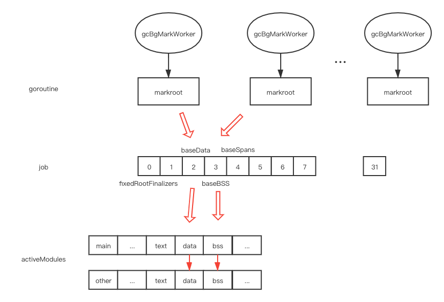
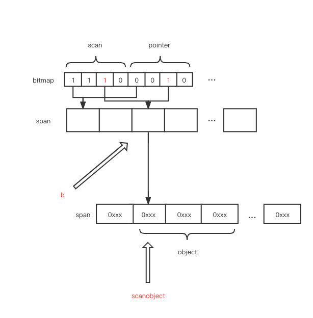

# gc

# 目录

[相关位置文件](#相关位置文件)

[概览](#概览)

[gc启动时机](#gc启动时机)

[gc工作机制](#gc工作机制)

* [markroot](#markroot)
* [scanblock](#scanblock)
* [scanobject](#scanobject)

[更多资料](#更多资料)

# 相关位置文件

* src/runtime/mgc.go
* src/runtime/malloc.go
* src/runtime/mgcmark.go
* src/runtime/mbitmap.go

## 概览

本文侧重点是从源码角度分析gc的不同阶段的实现, 在此之前你需要了解 [三色标记法](https://pusher.github.io/tricolor-gc-visualization/) 和 [go 中的垃圾回收](https://www.ardanlabs.com/blog/2018/12/garbage-collection-in-go-part1-semantics.html) (参加 [更多资料](#更多资料) 中的文章)

同时也需要对 [go 内存分配](https://github.com/zpoint/Go-Internals/blob/master/runtime/memory_management/memory_management_cn.md)  有基本的了解

```bash
go tool compile -S -N example_new.go > file.s
go run -gcflags '-N -l' example_new.go
```

```go
// example_new.go
package main

func i() *int {
	r := new(int)
	return r
}

func main() {
	i()
}
```

我们查看 `file.s` 可以发现编译器会把 `new(int)` 这行调用到 `runtime.newobject`,  找到 `runtime.newobject` 的函数定义, 我们可以发现我们需要的空间都会从 `span` 中获取到, 如果你申请的对象类型中不包含指针, 那么会从 `noscan`  span 中获取, 如果你申请的对象类型中包含了指针, 就会从 `scan` span 中获取, 并且对应的  `heapArena` 结构中的 `bitmap` 也会被标记上,  `bitmap` 被标记后, gc 在扫描对应地址的时候就可以查询这个 `bitmap` 看对应的地址是否是指向其他地方的指针

## gc启动时机

 `src/runtime/mgc.go` 定义的 `gcStart`   有三处入口


标准的入口在 `src/runtime/mgc.go` 的`GC` 函数中, 另外两个在  `src/runtime/malloc.go` 的 `mallocgc`  和 `src/runtime/proc.go` 的 `forcegchelper`

* `mallocgc` 是用来申请空间的函数, 他在申请空间的末尾会检查是否需要启动 gc

* `forcegchelper` 会启动一个 goroutine, 并且在卡在一个无限循环中等待执行 gc 的信号, 这个信号是 `sysmon` 发出的, 所以 `sysmon` 会隔一段时间检查是否需要触发 gc
* `GC` 就是 `runtime.GC()` , 他会进行一轮垃圾回收, 并且直到垃圾回收结束之前都阻塞调用方, 这个调用有可能阻塞住整个进程(STW), 他是自行触发垃圾回收的入口

## gc工作机制

## markroot

`gcBgMarkStartWorkers` 会启动 N 个 goroutines, 总共会有 N 个 goroutines 同时在运行 `gcBgMarkWorker` 

`gcBgMarkWorker`  会调用 `gcDrain`, 这个方法又往下调用到 `markroot` 和 `scanobject`


我们首先来看 `markroot` 

有多个 `goroutine` 会同时运行 `markroot`， 整数 `job` 是一个全局变量, 每个数字表示在当每个 `module`  对象中一段特定的内存范围

每个 `goroutine` 都在当前循环中原子的加这个值, 加成功了则表示获取到了这个数字对应的这一段范围的标记工作, 之后就会遍历所有的 `module` 对象, 并调用 `markroot` 去对这一段范围内的内存进行标记



## scanblock

`markroot` 会调用到 `scanblock`, 下图展示了 `scanblock` 的工作机制

`ptrmask` 中的每个 `bit` 表示了当前的指针(`p` ) 是否是正常在使用的指针

如果是一个正常的指针, 并且表示了一个 `heap` 中分配的对象, 那么就会调用 `greyobject`  方法


如果当前对象所属的 `span` 是 `noscan` 的, 则标记为灰色就结束

如果当前对象所属的 `span` 是 `scan` 的,  `greyobject` 会把当前对象继续放到 gc 扫描的队列中

## scanobjct

在 `markroot` 之后, `gcDrain` 会在一个循环中调用 `scanobject`

```go
// 把 heap 中剩下未标记的对象标记完 
// 如果被抢占了或者其他协程想要 STW 则停止
for !(gp.preempt && (preemptible || atomic.Load(&sched.gcwaiting) != 0)) {
  b := gcw.tryGetFast()
  // check b(skip)
  scanobject(b, gcw)
  // ...
}
```

在 for 循环中, `gcw.tryGetFast` 会返回一个指针, 这个指针就是上一个过程中 `greyobject` 放入的

这个指针是 `b`, 对应的 `arena`, `span` 可以通过下述代码获得 

如果你不了解 `heapArena` /`span`/`bitmap`  是什么, 请参考 [go 内存管理机制](https://github.com/zpoint/Go-Internals/blob/master/runtime/memory_management/memory_management_cn.md)

```go
ai := arenaIndex(b)
ha := h.arenas[ai.l1()][ai.l2()]
```


通过 `b`  的值, 我们又能获取到 `b` 所属的 `span`, 对应的 `heapArena` 和 `heapArena` 中存储的 `bitmap`, `span` 中存储了被指向的大小, `bitmap` 中存储了这个值是否是指针, 通过这些信息, 我们逐字节扫描完 b 指向的对象, 如果他是指针则继续放入队列, 如果不是则跳过, 重复上述循环即可完成扫描



# 更多资料

[garbage-collection-in-go-part1](https://www.ardanlabs.com/blog/2018/12/garbage-collection-in-go-part1-semantics.html)

[garbage-collection-in-go-part2](https://www.ardanlabs.com/blog/2019/05/garbage-collection-in-go-part2-gctraces.html)

[garbage-collection-in-go-part3](https://www.ardanlabs.com/blog/2019/07/garbage-collection-in-go-part3-gcpacing.html)

[easy-to-read-golang-assembly-output](https://stackoverflow.com/questions/23789951/easy-to-read-golang-assembly-output)

[go-how-does-the-garbage-collector-mark-the-memory](https://medium.com/a-journey-with-go/go-how-does-the-garbage-collector-mark-the-memory-72cfc12c6976)

[Golang源码探索(三) GC的实现原理](https://www.cnblogs.com/zkweb/p/7880099.html)

[Golang 垃圾回收剖析](http://legendtkl.com/2017/04/28/golang-gc/)
