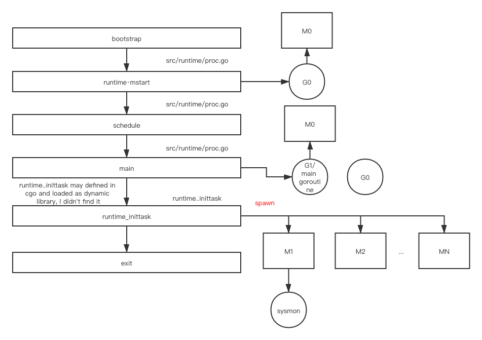
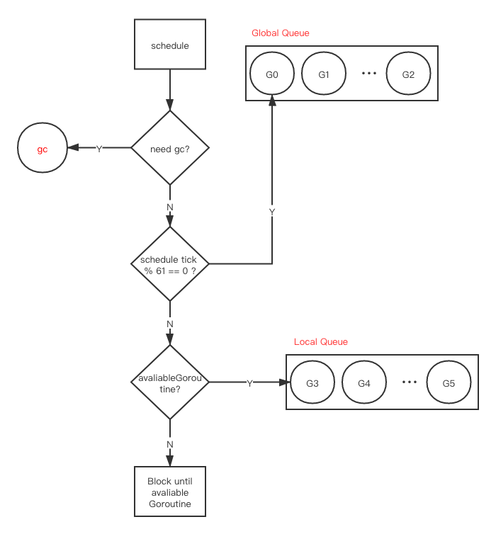
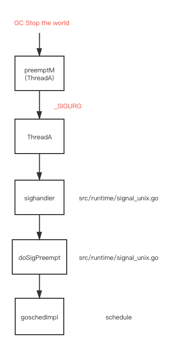

# goroutine

## 目录

[相关位置文件](#相关位置文件)

[概览](#概览)

[调度](#调度)

[为什么](#为什么)

[触发时机](#触发时机)

[更多资料](#更多资料)

## 相关位置文件

* src/runtime/runtime2.go
* src/runtime/proc.go
* src/plugin/plugin_dlopen.go

## 概览

```shell
# based on the current master branch which is 1.15
cd go
git reset --hard d317ba5d4489c1ef53d3077afbff30eb72d7d3b0
```

如果你对 **MPG 在Go协程调度中代表什么并且是如何工作的** 感到疑惑, 请先参考 [更多资料](#更多资料) 中的 [scheduling-in-go-part1](https://www.ardanlabs.com/blog/2018/08/scheduling-in-go-part1.html) 到 [scheduling-in-go-part3](https://www.ardanlabs.com/blog/2018/12/scheduling-in-go-part3.html) 

根据上述文章以及 Go 源码中的注释

> M
>
> 操作系统线程,  ‘M’ 是 machine 的简写, 这个线程其实是被操作系统调度的, 并且操作系统仍然负责把线程调度到某个核心上运行
>
> P
>
> 逻辑处理器, 执行 Go 代码的时候, 必须要获得的资源. M 必须拥有与之相关联的 P 才能执行 Go 代码. 但是 M 不论在是否存在与之对应的 P 的时候, 都能被阻塞住或者卡在系统调用中
>
> G
>
> 一个 Goroutine 就是一个 [协程](https://zh.wikipedia.org/wiki/%E5%8D%8F%E7%A8%8B), 但是这是 Go, 所以我们把字母 “C”(Coroutine) 替换成 “G”(Goroutine), 你可以把 Goroutine 当成应用级别的线程, 他们和系统级别的线程在很多地方都非常相似, 只是说操作系统的线程是在 CPU 核心上进行上下文切换(切入切出), 而 Goroutine 是在 M 上进行上下文切换(切入切出)


图片来自 [scheduling-in-go-part2](https://www.ardanlabs.com/blog/2018/08/scheduling-in-go-part2.html)

```shell
# GOSSAFUNC=main GOOS=linux GOARCH=amd64 go build -gcflags "-S" simple.go
# GOSSAFUNC=main go_dev build -gcflags "-S" num_cpu.go
# GODEBUG=schedtrace=DURATION,gctrace=1 go_dev run num_cpu.go
# GODEBUG=schedtrace=DURATION go_dev run num_cpu.go
find . -name '*.go' -exec grep -nHr 'inittask' {} \;
```

bootstrap 流程的一部分会在默认的 **M**(**M0**) 上运行一个 **G**, 这个 **G** 会执行 `runtime.mstart`, `runtime.mstart` 最终会进入 `schedule` 函数, `schedule` 函数会把 **G1** 调度到当前的 **M**(**M0**) 上运行, **G1** 会进入  `runtime/proc.go` 的 `main` 函数, `main` 中的 `doInit(&runtime_inittask)` 会默认初始化并生成至多 N 个 **M**(系统线程), N 是CPU核心数目, 在这之后, **G1** 运行到函数的末尾并执行 `exit(0)`

实际上, 在 `runtime_inittask` 之前, 就会有一个新的  **M**(thread) 被生成, 一个 goroutine 会在 **M** 上执行 `sysmon` 函数, 之后 `runtime_inittask` 才会生成最多到 N 个 **M**(线程)

我们以更直观的图表来展示一下



对于 **M1** ... **MN** 中的每个 **M**, 都会有一个新的 **G** 在上面运行, 并且每个 **M** 上都会执行到 `runtime.mstart`, 通过 `runtime.mstart` 最终都会进入 `schedule` 函数并且让调度器进行调度

我没有在源码中的 `go` 或 `c` 文件中找到 `runtime_inittask`, 但是我在 `src/plugin/plugin_dlopen.go` 中找到了从 `c` 动态链接库中装载 `inittask` 的方法, 也许他在 `src/runtime/asm_amd64.s` 这个汇编代码中, 后续找到再来研究这一块内容(如果你在我之前找到了, 欢迎提 pull request)

## 调度

可以在  `src/runtime/proc.go` 找到  `schedule` 函数的定义

```go
// 执行一轮调度: 找到一个可执行的 goroutine 并执行它
// 这个函数不会返回
func schedule() {
		// ...
  	if gp == nil && gcBlackenEnabled != 0 {
		gp = gcController.findRunnableGCWorker(_g_.m.p.ptr())
		tryWakeP = tryWakeP || gp != nil
		}
  	if gp == nil {
		// 隔一段时间检查一下全局 goroutine 队列, 来保证公平
		// 不然的话, 两个在本地队列的 goroutine 可以通过循环互相产生对方作为一个新的 goroutine 的方式, 来让本地队列永远有任务运行
		if _g_.m.p.ptr().schedtick%61 == 0 && sched.runqsize > 0 {
			lock(&sched.lock)
			gp = globrunqget(_g_.m.p.ptr(), 1)
			unlock(&sched.lock)
			}
		}
		if gp == nil {
			gp, inheritTime = runqget(_g_.m.p.ptr())
		}
		if gp == nil {
			gp, inheritTime = findrunnable() // 这个调用会阻塞, 知道有任务可以执行为止才返回
		}
		// ...
		execute(gp, inheritTime)
}
```

调度的流程就比较清晰了

(对于每个**P**)每隔61次调用调度之后, 就会尝试从全局队列里取一个任务出来, 默认情况则是从本地队列取一个任务出来(当前**P**对应的队列中)

> 最后一部分的谜团就是运行队列(run queues), Go 的调度系统中有两种不同的运行队列, 全局运行队列(Global Run Queue/GRQ)和本地运行队列(Local Run Queue/LRQ), 每个 P 身上存储了一个对应的 LRQ 数据结构, 这个结构用来管理并存储 Goroutine, 这里的 Goroutine 运行时也需要依赖 P 的环境. 这些 P 身上存储的 Goroutine 轮流从 M 上面切换上去/切换出来(上下文切换). GRQ 是用来存储还没有对应的 P 的 Goroutine 的, 后续会讨论一个流程是把 Goroutine 从 GRQ 移动到 LRQ 的 (我: 上面代码中已经展示了)

翻译自 [scheduling-in-go-part2](https://www.ardanlabs.com/blog/2018/08/scheduling-in-go-part2.html)




在 `schedule` 中, `findrunnable` 会找到一个在当前 **P** 中可以运行的 goroutine, 本地队列是存储在 **P** 内部的

## 为什么

对于操作系统级别的线程(**M**)在 CPU 中进行上下文切换

> 每一次上下文切换都会导致潜在的约 1000 纳秒的延时, 假设硬件的运行速度是每纳秒 12 个 CPU 指令, 你会发现在线程切换的时候本来可以执行 12000 个指令, 但是现在并没有执行, 并且线程还可能在 CPU 不同的核心间切换, CPU 缓存在这种情况下会失效, 会导致更大的线程切换开销, 更高的延时

对于用户级别的协程(Goroutinue/**G**) 在 **M** 中进行上下文切换, 从操作系统的角度上看, 只是同一个线程在不停地执行指令而已, 并且只要你的 **Goroutinue** 有足够多的工作要做, 操作系统会认为你是一个 CPU 密集型的线程

> 本质上, Go 把你的 IO/阻塞型 应用在操作系统层面变成了 CPU 密集型应用. 因为所有的上下文切换都发生在了应用层, 当我们通过线程运行程序时, 我们不会平均每次上下文切换都丢失大约 12000 个指令的执行时间. 在 Go 里, 相似的上下文切换占用大约 200 纳秒, 或者 2400 个指令,  并且调度器调度时会考虑到 CPU 缓存以及 [NUMA](http://frankdenneman.nl/2016/07/07/numa-deep-dive-part-1-uma-numa). 这也是为什么我们生成的线程数不需大于我们的核心数的原因
>
> 在 Go 中, 随着程序的运行, 我们可以认为更多的任务会被执行并且完成, 因为 Go 调度器会尝试用尽可能少的线程并且在每个线程中执行尽可能多的任务(协程), 通过这种方式降低操作系统和硬件的开销

翻译自 [scheduling-in-go-part2](https://www.ardanlabs.com/blog/2018/08/scheduling-in-go-part2.html)

## 触发时机

对于非抢占式调度, 主动释放硬件资源给其他 `G` 的函数入口

```go
// src/runtime/proc.go
/* mstart 是一个新的 M(线程) 的函数主入口
   它是用汇编语言写的, 用的是 ABI0, 标记名称为 TOPFRAME, 之后调用 mstart0
*/
func mstart1()

// src/runtime/proc.go
/* 把当前的 go 协程设置到等待的状态, 并且在系统调用栈调用 unlockf
/* 
   这个函数在 chansend(管道发送), gc(垃圾回收), netpoll(网络), select(事件循环), sleep 等多个地方都进行了调用
*/
func park_m(gp *g)

// src/runtime/proc.go
/* 在 runtime.Gosched() 和 gopreempt_m 进行了调用
*/
func goschedImpl(gp *g)

// src/runtime/proc.go
/* goyield 和 Gosched 相似, 但是它:
   - 发送的是抢占信号而不是调度信号
   - 把当前的 G 放到当前的 P 的本地队列中而不是全局队列中
   在 semrelease 中调用
*/ 
func goyield_m(gp *g)

// src/runtime/proc.go
/* Goexit 会在不影响其他协程的情况下终止调用它的 go 协程
   Goexit 会在结束 go 协程之前调用所有 defer 函数, 因为 Goexit 不是一个 panic, 在这些 defer 
   函数中的 recover 调用都会返回空

	 在主协程中调用 Goexit 会终止当前 go 协程, 但是 main 函数不会返回
	 只要 main 函数不返回, 其他的 go 协程还能继续运行
   如果所有其他的 go 协程都退出了, 当前的进程也会 crash
   调用入口是 rumtime.Goexit()
*/ 
func goexit0(gp *g)

// src/runtime/proc.go
/* go 协程退出系统调用时, 需要调用 schedule 去绑定到对应的硬件资源上执行
   只在 go 的 syscall 库中调用, runtime 不会调用
*/ 
func exitsyscall0(gp *g)
```

对于抢占式调度

```go
// src/runtime/proc.go
func preemptone(_p_ *p)

// src/runtime/signal_unix.go
func preemptM(mp *m)

// src/runtime/proc.go
/* It called in asyncPreempt2 
   asyncPreempt2->preemptPark->schedule
*/
func preemptPark(gp *g)
```

调用栈如下

```go
// const sigPreempt = _SIGURG
preemptone->preemptM->signalM(mp, sigPreempt)
```

我们可以发现 go 通过 unix 信号实现抢占式调度, 它把指定信号发送给 **M**(线程), 已经注册好的信号处理函数会把当前的上下文保存, 并一路调用到 schedule 中(并不是每次都这么执行, 如果当前的协程不符合切换条件, 这个信号就会被忽略)

在垃圾回收的 STW 阶段会对这个信号进行发送



 ## 更多资料

[scheduling-in-go-part1](https://www.ardanlabs.com/blog/2018/08/scheduling-in-go-part1.html)

[scheduling-in-go-part2](https://www.ardanlabs.com/blog/2018/08/scheduling-in-go-part2.html)

[scheduling-in-go-part3](https://www.ardanlabs.com/blog/2018/12/scheduling-in-go-part3.html)

[how-a-go-program-compiles-down-to-machine-code](https://getstream.io/blog/how-a-go-program-compiles-down-to-machine-code/)

[How to call private functions (bind to hidden symbols) in GoLang](https://sitano.github.io/2016/04/28/golang-private/)

