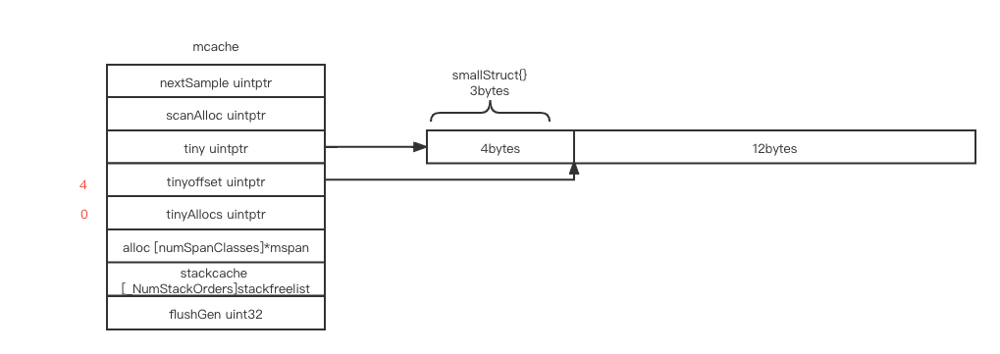
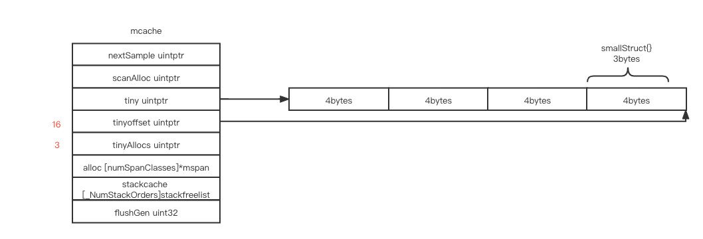

# memory management

# contents

[related file](#related-file)

[mallocgc](#mallocgc)

* [<=16b](#<=16b)
* [<=32kb](#<=32kb)
* [>32kb](#>32kb)

[read more](#read-more)

# related file

* src/runtime/mgc.go
* src/runtime/malloc.go
* src/runtime/mgcmark.go
* src/runtime/mbitmap.go


# mallocgc


> The annotation `//go:noinline` will disable in-lining that would optimize the code by removing the function and, therefore, end up with no allocation.

```go
package main

//go:noinline
func f() *int {
	var a int = 3
	return &a
}

func main() {
	f()
}

```

We compile the above code with `go tool compile -S main.go` , we can find that the address of `type.int` is loaded into `AX`, and `runtime.newobject` will be called with the just loaded parameter(address of `type.int`)

## <=16b

For object size < 16 bytes

```go
package main

type smallStruct struct {
	// 3 bytes
	a int16
	b int8
}

//go:noinline
func f() *smallStruct {
	return &smallStruct{}
}

func main() {
	f()
  f()
  f()
  f()
}
```

The size will be rounded up to (2, 4, 8) bytes for alignment, and will be allocated from current `M`'s tiny cache

 After the first `f()`

`tiny` points to a 16 bytes block allocated from a specifc span in `alloc`

 The 3 bytes `smallStruct` is rounded up to 4 byte for alignment, and the first 4 bytes in `tiny` is use for the current `smallStruct`



After the second `f()`, the `5 - 7` bytes is allocated for the new  `smallStruct`, the actual space itallocated still round up to 4 bytes

`tinyAllocs` bbecomes 1, it means how many objects allocated in the current `tiny` except the first object


After the third `f()`, `tinyoffset` becomes `12` and `tinyAllocs` becomes 2


After the final `f()`, now we've used all the space in the current `tiny`, next time you trigger the condition `<=16b`,  a new memory block of size 16 bytes will be allocated from the specific span `mcache.alloc[tinySpanClass]`, and `tiny` will points to the address of newly allocated memory, the whole procedure will repeat again




## <=32kb

For object size < =32kb

```go
package main

type smallStruct struct {
	a, b int64
	c, d float64
}

//go:noinline
func f() *smallStruct {
	return &smallStruct{}
}

func main() {
	f()
}
```

This is the span before running `f()`


This is the span after running `f()`, the block`freeindex` pointed to is used for current allocation, and `freeindex` is moved forward


each bit in `allocBits` represents a block in the current span, i.e, the first bit in the first byte represent whether the first block is in used after the last gc


`freeindex` points to the next free block, `allocCache` is of type `uint64`,  at first, it cache the first 64 bits in `allocBits`, it's value is  `^allocBits[0]~allocBits[7]`, so that we can get the next free index by counting the trailing zeros in `allocCache`, after we used the final block in `allocCache`, `allocCache` will cache the next 64 bits in `allocBits`, it's value becomes `^allocBits[8]~allocBits[15]`, and so on

## >32kb

For object size >=32kb, the page size needed will be calculated(`npages := size >> _PageShift`), and a new span with page number `npages` will be allocated from `heap`

```go
package main

type smallStruct struct {
	// 16kb + 16kb + 1b
	a [2048]int64
	b [2048]uintptr
	c int8
}

//go:noinline
func f() *smallStruct {
	return &smallStruct{}
}

func main() {
	f()
}
```

After `f()`, a new span with `spanClass->1` will be allocated from heap, and the whole span only contains one element, with element size `5 * 8096 == 40960 bytes` (5 pages)

The actual size needed is `32769 bytes`, but the unit span allocated is pages, so the size is rounded up to next bigger page number


# read more

[Go 内存分配器的设计与实现](https://mp.weixin.qq.com/s/pjxIbAsVzkdXI7KFSeE8hQ)

[go memory management and allocation](https://medium.com/a-journey-with-go/go-memory-management-and-allocation-a7396d430f44)

