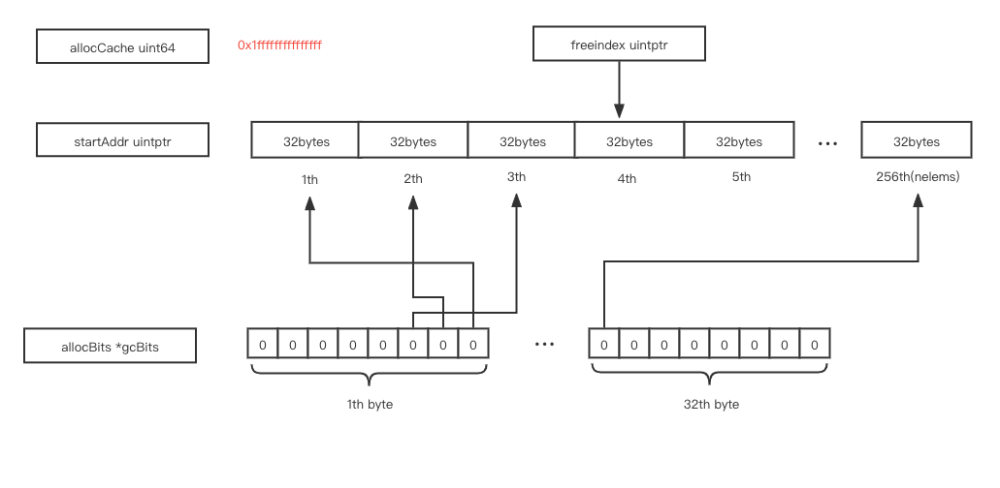

# memory management

# contents

[related file](#related-file)

[read more](#read-more)

# related file

* src/runtime/mgc.go
* src/runtime/malloc.go
* src/runtime/mgcmark.go
* src/runtime/mbitmap.go


## span


> The annotation `//go:noinline` will disable in-lining that would optimize the code by removing the function and, therefore, end up with no allocation.

```go
package main

//go:noinline
func f() *int {
	var a int = 3
	return &a
}

func main() {
	f()
}

```

We compile the above code with `go tool compile -S main.go` , we can find that the address of `type.int` is loaded into `AX`, and `runtime.newobject` will be called with the just loaded parameter(address of `type.int`)

For object size < 16 bytes

For object size < 32kb

```go
package main

type smallStruct struct {
	a, b int64
	c, d float64
}

//go:noinline
func f() *smallStruct {
	return &smallStruct{}
}

func main() {
	f()
}
```

This is the span before running `f()`


This is the span after running `f()`, the block`freeindex` pointed to is used for current allocation, and `freeindex` is moved forward


each bit in `allocBits` represents a block in the current span, i.e, the first bit in the first byte represent whether the first block is in used after the last gc



`freeindex` points to the next free block, `allocCache` is of type `uint64`,  at first, it cache the first 64 bits in `allocBits`, it's value is  `^allocBits[0]~allocBits[7]`, so that we can get the next free index by counting the trailing zeros in `allocCache`, after we used the final block in `allocCache`, `allocCache` will cache the next 64 bits in `allocBits`, it's value becomes `^allocBits[8]~allocBits[15]`, and so on


# read more

[Go 内存分配器的设计与实现](https://mp.weixin.qq.com/s/pjxIbAsVzkdXI7KFSeE8hQ)

[go memory management and allocation](https://medium.com/a-journey-with-go/go-memory-management-and-allocation-a7396d430f44)

