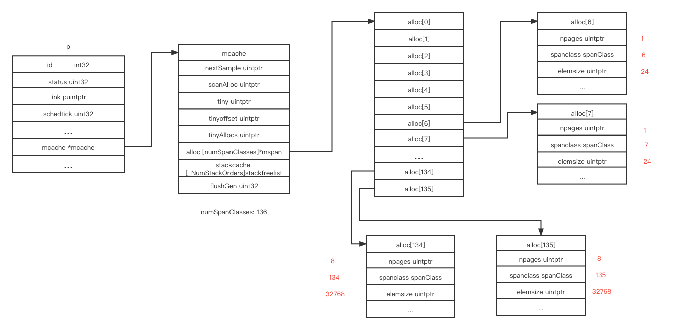
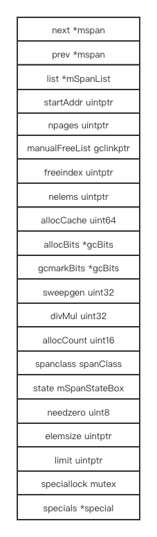
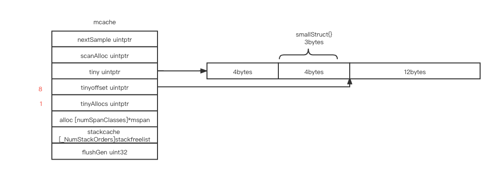
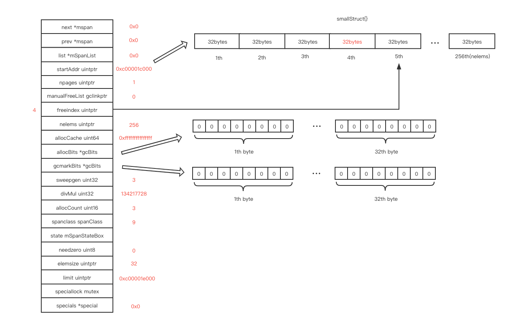
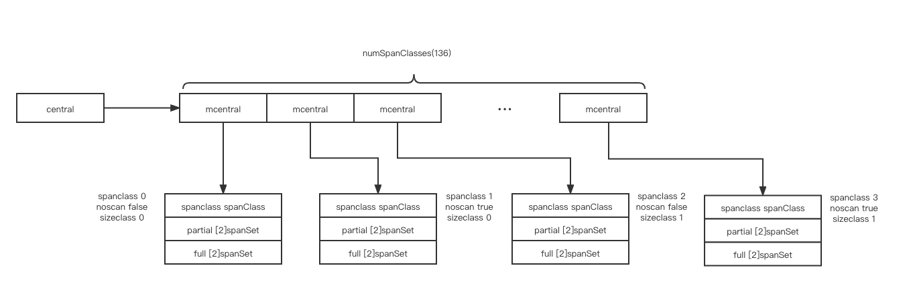

# memory management

# contents

[related file](#related-file)

[span](#span)

[mallocgc](#mallocgc)

* [<=16b](#<=16b)
* [<=32kb](#<=32kb)
* [>32kb](#>32kb)
* [contains pointer](#contains-pointer)

[heap](#heap)

[read more](#read-more)

# related file

* src/runtime/mgc.go
* src/runtime/malloc.go
* src/runtime/mgcmark.go
* src/runtime/mbitmap.go

# span

Every `P` stores a pointer `mcache`, which caches a list of different size of span

 ```go
 // src/runtime/mcache.go
 func allocmcache() *mcache {
 	var c *mcache
 	systemstack(func() {
 		lock(&mheap_.lock)
 		c = (*mcache)(mheap_.cachealloc.alloc())
 		c.flushGen = mheap_.sweepgen
 		unlock(&mheap_.lock)
 	})
 	for i := range c.alloc {
 		c.alloc[i] = &emptymspan
 	}
 	c.nextSample = nextSample()
 	return c
 }
 ```

`numSpanClasses` is 136 by default, The `alloc` array in `mcache` stores 136 different `span`, `alloc[2]` and `alloc[3]` are of the same size, one for `noscan`(object without pointer) and one for `scan`,  `alloc[4]` and `alloc[5]` are also of the same size, and so on, element size vary from 8 bytes to 32kb

The odd one is used for `noscan` and even one is used for scan

The `span` is not allocated when the program started, it's allocated on the fly(when you request the specific size of `span`) 



```go
// src/runtime/sizeclasses.go
// class  bytes/obj  bytes/span  objects  tail waste  max waste  min align
//     1          8        8192     1024           0     87.50%          8
//     2         16        8192      512           0     43.75%         16
//     3         24        8192      341           8     29.24%          8
//     4         32        8192      256           0     21.88%         32
//     5         48        8192      170          32     31.52%         16
//     6         64        8192      128           0     23.44%         64
//     7         80        8192      102          32     19.07%         16
//     8         96        8192       85          32     15.95%         32
//     9        112        8192       73          16     13.56%         16
//    10        128        8192       64           0     11.72%        128
//    11        144        8192       56         128     11.82%         16
//    12        160        8192       51          32      9.73%         32
//    13        176        8192       46          96      9.59%         16
//    14        192        8192       42         128      9.25%         64
//    15        208        8192       39          80      8.12%         16
//    16        224        8192       36         128      8.15%         32
//    17        240        8192       34          32      6.62%         16
//    18        256        8192       32           0      5.86%        256
//    19        288        8192       28         128     12.16%         32
//    20        320        8192       25         192     11.80%         64
//    21        352        8192       23          96      9.88%         32
//    22        384        8192       21         128      9.51%        128
//    23        416        8192       19         288     10.71%         32
//    24        448        8192       18         128      8.37%         64
//    25        480        8192       17          32      6.82%         32
//    26        512        8192       16           0      6.05%        512
//    27        576        8192       14         128     12.33%         64
//    28        640        8192       12         512     15.48%        128
//    29        704        8192       11         448     13.93%         64
//    30        768        8192       10         512     13.94%        256
//    31        896        8192        9         128     15.52%        128
//    32       1024        8192        8           0     12.40%       1024
//    33       1152        8192        7         128     12.41%        128
//    34       1280        8192        6         512     15.55%        256
//    35       1408       16384       11         896     14.00%        128
//    36       1536        8192        5         512     14.00%        512
//    37       1792       16384        9         256     15.57%        256
//    38       2048        8192        4           0     12.45%       2048
//    39       2304       16384        7         256     12.46%        256
//    40       2688        8192        3         128     15.59%        128
//    41       3072       24576        8           0     12.47%       1024
//    42       3200       16384        5         384      6.22%        128
//    43       3456       24576        7         384      8.83%        128
//    44       4096        8192        2           0     15.60%       4096
//    45       4864       24576        5         256     16.65%        256
//    46       5376       16384        3         256     10.92%        256
//    47       6144       24576        4           0     12.48%       2048
//    48       6528       32768        5         128      6.23%        128
//    49       6784       40960        6         256      4.36%        128
//    50       6912       49152        7         768      3.37%        256
//    51       8192        8192        1           0     15.61%       8192
//    52       9472       57344        6         512     14.28%        256
//    53       9728       49152        5         512      3.64%        512
//    54      10240       40960        4           0      4.99%       2048
//    55      10880       32768        3         128      6.24%        128
//    56      12288       24576        2           0     11.45%       4096
//    57      13568       40960        3         256      9.99%        256
//    58      14336       57344        4           0      5.35%       2048
//    59      16384       16384        1           0     12.49%       8192
//    60      18432       73728        4           0     11.11%       2048
//    61      19072       57344        3         128      3.57%        128
//    62      20480       40960        2           0      6.87%       4096
//    63      21760       65536        3         256      6.25%        256
//    64      24576       24576        1           0     11.45%       8192
//    65      27264       81920        3         128     10.00%        128
//    66      28672       57344        2           0      4.91%       4096
//    67      32768       32768        1           0     12.50%       8192

```

This is layout of `mspan`



# mallocgc

> The annotation `//go:noinline` will disable in-lining that would optimize the code by removing the function and, therefore, end up with no allocation.

```go
package main

//go:noinline
func f() *int {
	var a int = 3
	return &a
}

func main() {
	f()
}

```

We compile the above code with `go tool compile -S main.go` , we can find that the address of `type.int` is loaded into `AX`, and `runtime.newobject` will be called with the just loaded parameter(address of `type.int`)

## <=16b

For object size < 16 bytes

```go
package main

type smallStruct struct {
	// 3 bytes
	a int16
	b int8
}

//go:noinline
func f() *smallStruct {
	return &smallStruct{}
}

func main() {
	f()
  f()
  f()
  f()
}
```

The size will be rounded up to (2, 4, 8) bytes for alignment, and will be allocated from current `M`'s tiny cache

 After the first `f()`

`tiny` points to a 16 bytes block allocated from a specifc span in `alloc`

 The 3 bytes `smallStruct` is rounded up to 4 byte for alignment, and the first 4 bytes in `tiny` is use for the current `smallStruct`


After the second `f()`, the `5 - 7` bytes is allocated for the new  `smallStruct`, the actual space itallocated still round up to 4 bytes

`tinyAllocs` bbecomes 1, it means how many objects allocated in the current `tiny` except the first object



After the third `f()`, `tinyoffset` becomes `12` and `tinyAllocs` becomes 2


After the final `f()`, now we've used all the space in the current `tiny`, next time you trigger the condition `<=16b`,  a new memory block of size 16 bytes will be allocated from the specific span `mcache.alloc[tinySpanClass]`, and `tiny` will points to the address of newly allocated memory, the whole procedure will repeat again


## <=32kb

For object size < =32kb

```go
package main

type smallStruct struct {
	a, b int64
	c, d float64
}

//go:noinline
func f() *smallStruct {
	return &smallStruct{}
}

func main() {
	f()
}
```

This is the span before running `f()`


This is the span after running `f()`, the block `freeindex` pointed to is used for current allocation, and `freeindex` is moved forward



each bit in `allocBits` represents a block in the current span, i.e, the first bit in the first byte represent whether the first block is in used after the last gc


`freeindex` points to the next free block, `allocCache` is of type `uint64`,  at first, it cache the first 64 bits in `allocBits`, it's value is  `^allocBits[0]~allocBits[7]`, so that we can get the next free index by counting the trailing zeros in `allocCache`, after we used the final block in `allocCache`, `allocCache` will cache the next 64 bits in `allocBits`, it's value becomes `^allocBits[8]~allocBits[15]`, and so on

During gc sweep phase,`gcmarkBits` will store the latest mark for all elements in the current span, and after gc, `allocBits` 's value will be replaced by `gcmarkBits`'s value,  `allocCache` and `freeindex` will also be reset

## >32kb

For object size >=32kb, the page size needed will be calculated(`npages := size >> _PageShift`), and a new span with page number `npages` will be allocated from `heap`

```go
package main

type smallStruct struct {
	// 16kb + 16kb + 1b
	a [2048]int64
	b [2048]uintptr
	c int8
}

//go:noinline
func f() *smallStruct {
	return &smallStruct{}
}

func main() {
	f()
}
```

After `f()`, a new span with `spanClass->1` will be allocated from heap, and the whole span only contains one element, with element size `5 * 8096 == 40960 bytes` (5 pages)

The actual size needed is `32769 bytes`, but the unit span allocated is pages, so the size is rounded up to next bigger page number


At the end mallocing, if  our go runtime is in the middle of gc phase, the current object will be marked as black(the corresponding bit in `gcmarkBits` will be set)

# contains pointer

The above allocated object does not contains pointer, the noscan flag is always true, and the noscan span will always be used

What if the allocated object contains pointer ?

```go
package main

type myObject struct {
	a int64
	b [16] int64
}

type smallStruct struct {
	a [8]int64
	b [32]*myObject
	c [8]uint64
}

//go:noinline
func f() *smallStruct {
	return &smallStruct{}
}

func main() {
	f()
}

```

This is type object of `smallStruct` go generated in runtime

`size` is the total size in bytes of the `smallStruct`

`ptrdata` means the first `ptrdata`  bytes may contains pointer somewhere, from `ptrdata` to the end does not contain any pointer 

`gcdata` points to an array of byte, each byte represent whether each bit it represent is pointer


Their relation


# heap

This is the basic structure of go runtime heap


The `heapArena` of a specific address can be computed by the following two lines

```go
ai := arenaIndex(base)
ha := h.arenas[ai.l1()][ai.l2()]
```

> // A heapArena stores metadata for a heap arena. heapArenas are stored outside of the Go heap and accessed via the mheap_.arenas index.

`heapArenaBitmapBytes` is 2097152 on my platform, and `pagesPerArena` is 8192, it means the metadata each arena in arenas represents 8mb(2097152 / 2 * 8) space

This is how metadata in `bitmap` field represents the actual data, the lower 4 bits represents whether the pointer size object it points to is a pointer, and the higher 4 bits represents whether the object it points to may contains other pointer(need to be scaned)

> ```go
> // In each 2-bit entry, the lower bit is a pointer/scalar bit, just
> // like in the stack/data bitmaps described above. The upper bit
> // indicates scan/dead: a "1" value ("scan") indicates that there may
> // be pointers in later words of the allocation, and a "0" value
> // ("dead") indicates there are no more pointers in the allocation. If
> // the upper bit is 0, the lower bit must also be 0, and this
> // indicates scanning can ignore the rest of the allocation.
> //
> // The 2-bit entries are split when written into the byte, so that the top half
> // of the byte contains 4 high (scan) bits and the bottom half contains 4 low
> // (pointer) bits. This form allows a copy from the 1-bit to the 4-bit form to
> // keep the pointer bits contiguous, instead of having to space them out.
> ```


The `central` is described in the following diagram

> ```go
> // central free lists for small size classes.
> // central is indexed by spanClass.
> ```

`spanSet` is a stack like structure which provide concurrency push and pop interface, the implementation looks like `c++ vector` 

> ```go
> // partial and full contain two mspan sets: one of swept in-use
> // spans, and one of unswept in-use spans. These two trade
> // roles on each GC cycle. The unswept set is drained either by
> // allocation or by the background sweeper in every GC cycle,
> // so only two roles are necessary.
> ```




We can learn more detail from the following source code

```go
// src/runtime/mheap.go

// Initialize the heap.
func (h *mheap) init() {
}

// Try to add at least npage pages of memory to the heap,
// returning whether it worked.
//
// h.lock must be held.
func (h *mheap) grow(npage uintptr) bool {
}

// allocSpan allocates an mspan which owns npages worth of memory.
func (h *mheap) allocSpan(npages uintptr, typ spanAllocType, spanclass spanClass) (s *mspan) {
}
```


Let's chain together


# read more

[Go 内存分配器的设计与实现](https://mp.weixin.qq.com/s/pjxIbAsVzkdXI7KFSeE8hQ)

[go memory management and allocation](https://medium.com/a-journey-with-go/go-memory-management-and-allocation-a7396d430f44)

