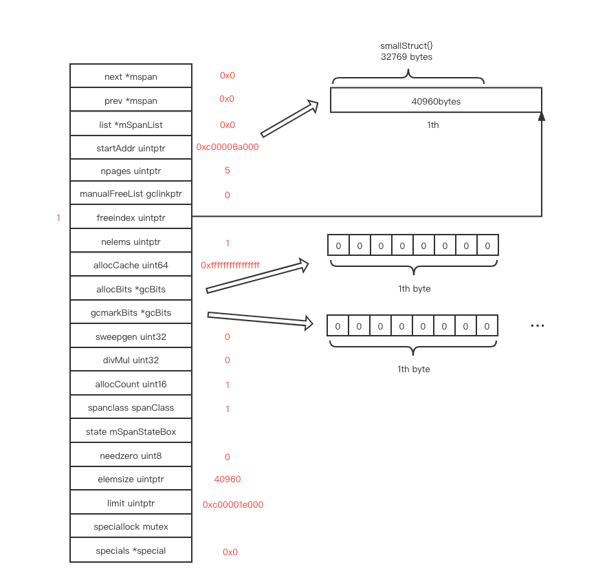

# memory management

# 目录

[相关位置文件](#相关位置文件)

[概览](#概览)

[span](#span)

[mallocgc](#mallocgc)

* [<=16b](#<=16b)
* [<=32kb](#<=32kb)
* [>32kb](#>32kb)
* [包含指针](#包含指针)

[heap](#heap)

[更多资料](#更多资料)

# 相关位置文件

* src/runtime/mgc.go
* src/runtime/malloc.go
* src/runtime/mgcmark.go
* src/runtime/mbitmap.go

# 概览


当你在 go 中申请内存空间时, 申请的内存空间直接来源于 `span`, 通常一个 `span` 存储了 8kb 大小的空间, `span` 中的每个元素大小是 `N`, 那么一个 `span` 就含有 8kb / `N`  个元素, `alloc` 会在 `span` 中获取一个空闲的元素

`mcache` 缓存了一些 `span` , `mcache` 是每个线程(在Go 里, 是每个 P)独有的一个线程缓存的结构, 在当前的 `P` 中缓存 136 个不同的 `span`, 每当你需要一个 `span` 时, 你可以在不加锁的情况下快速从这里获取到一个

如果当前需要的`span` 在 `macache` 中获取不到, 则会从 `mcentral` 中获取一个新的 `span`,  `mcentral` 存储了两个 `span` 的双链表, `mcentral` 是存储在 `heap` 中的全局变量, 获取时会在上述链表中查找到一个空闲的 `span`

如果`mcentral` 也获取不到, 则会从 `P` 的缓存中获取, `P ` 的缓存中的的 `span` 是从 `heap` 中申请的

`arena` 存储了 `heap` 空间中的元信息, 每个 `arena` 对象代表了 64MB 的空间的信息, 并且还有一个 `bitmap` 代表当前的空间中每个字节是否需要扫描, 是否存储了指针的标记信息

Go 把heap中所有的虚拟地址映射到了 `arena`  数组中不同的对象中, 当你拿到一个对象的地址时, 你可以通过 `(addr - base_addr) / range_length`  简单的计算就获取到对应的 `arena`  数组索引, 从而获得 `arena`  对象

映射(申请内存) 是通过 `mmap` [系统调用](https://man7.org/linux/man-pages/man2/mmap.2.html) 实现的, 这个申请并不会  [实际占用物理存储空间](https://stackoverflow.com/questions/12383900/does-mmap-really-copy-data-to-the-memory)

在 go 1.11 之后, 不同的 `arena` 中的地址不再是连续的

# span

每一个 `P` 都存储了一个指向 `mcache` 的指针, 这个对象缓存了一个列表, 列表里是元素大小不同的 `span`

 ```go
 // src/runtime/mcache.go
 func allocmcache() *mcache {
 	var c *mcache
 	systemstack(func() {
 		lock(&mheap_.lock)
 		c = (*mcache)(mheap_.cachealloc.alloc())
 		c.flushGen = mheap_.sweepgen
 		unlock(&mheap_.lock)
 	})
 	for i := range c.alloc {
 		c.alloc[i] = &emptymspan
 	}
 	c.nextSample = nextSample()
 	return c
 }
 ```

`numSpanClasses` 默认是 136,  `mcache` 中的 `alloc` 数组存储了 136 种不同的 `span`, `alloc[2]` 和 `alloc[3]`  大小相同, 一个是给 没有指针的对象 (`noscan` ) 用的, 一个是给包含指针的对象(`scan`)用的, `alloc[4]` 和 `alloc[5]` 大小相同, 以此类推

这些不同的 `span` 元素大小从 8bytes 到 32kb 不等, 列表中的基数个用作 `noscan`,  偶数个用作 `scan`

`span` 并没有在程序启动时就初始化好, 它是动态申请的(在你申请对应大小空间的时候进行申请的)


```go
// src/runtime/sizeclasses.go
// class  bytes/obj  bytes/span  objects  tail waste  max waste  min align
//     1          8        8192     1024           0     87.50%          8
//     2         16        8192      512           0     43.75%         16
//     3         24        8192      341           8     29.24%          8
//     4         32        8192      256           0     21.88%         32
//     5         48        8192      170          32     31.52%         16
//     6         64        8192      128           0     23.44%         64
//     7         80        8192      102          32     19.07%         16
//     8         96        8192       85          32     15.95%         32
//     9        112        8192       73          16     13.56%         16
//    10        128        8192       64           0     11.72%        128
//    11        144        8192       56         128     11.82%         16
//    12        160        8192       51          32      9.73%         32
//    13        176        8192       46          96      9.59%         16
//    14        192        8192       42         128      9.25%         64
//    15        208        8192       39          80      8.12%         16
//    16        224        8192       36         128      8.15%         32
//    17        240        8192       34          32      6.62%         16
//    18        256        8192       32           0      5.86%        256
//    19        288        8192       28         128     12.16%         32
//    20        320        8192       25         192     11.80%         64
//    21        352        8192       23          96      9.88%         32
//    22        384        8192       21         128      9.51%        128
//    23        416        8192       19         288     10.71%         32
//    24        448        8192       18         128      8.37%         64
//    25        480        8192       17          32      6.82%         32
//    26        512        8192       16           0      6.05%        512
//    27        576        8192       14         128     12.33%         64
//    28        640        8192       12         512     15.48%        128
//    29        704        8192       11         448     13.93%         64
//    30        768        8192       10         512     13.94%        256
//    31        896        8192        9         128     15.52%        128
//    32       1024        8192        8           0     12.40%       1024
//    33       1152        8192        7         128     12.41%        128
//    34       1280        8192        6         512     15.55%        256
//    35       1408       16384       11         896     14.00%        128
//    36       1536        8192        5         512     14.00%        512
//    37       1792       16384        9         256     15.57%        256
//    38       2048        8192        4           0     12.45%       2048
//    39       2304       16384        7         256     12.46%        256
//    40       2688        8192        3         128     15.59%        128
//    41       3072       24576        8           0     12.47%       1024
//    42       3200       16384        5         384      6.22%        128
//    43       3456       24576        7         384      8.83%        128
//    44       4096        8192        2           0     15.60%       4096
//    45       4864       24576        5         256     16.65%        256
//    46       5376       16384        3         256     10.92%        256
//    47       6144       24576        4           0     12.48%       2048
//    48       6528       32768        5         128      6.23%        128
//    49       6784       40960        6         256      4.36%        128
//    50       6912       49152        7         768      3.37%        256
//    51       8192        8192        1           0     15.61%       8192
//    52       9472       57344        6         512     14.28%        256
//    53       9728       49152        5         512      3.64%        512
//    54      10240       40960        4           0      4.99%       2048
//    55      10880       32768        3         128      6.24%        128
//    56      12288       24576        2           0     11.45%       4096
//    57      13568       40960        3         256      9.99%        256
//    58      14336       57344        4           0      5.35%       2048
//    59      16384       16384        1           0     12.49%       8192
//    60      18432       73728        4           0     11.11%       2048
//    61      19072       57344        3         128      3.57%        128
//    62      20480       40960        2           0      6.87%       4096
//    63      21760       65536        3         256      6.25%        256
//    64      24576       24576        1           0     11.45%       8192
//    65      27264       81920        3         128     10.00%        128
//    66      28672       57344        2           0      4.91%       4096
//    67      32768       32768        1           0     12.50%       8192

```

这是 `mspan` 的基本结构


# mallocgc

> `//go:noinline` 这行注释会禁用 in-line 优化, 不禁用的话, 编译器会把函数优化成不调用函数, 直接返回当前变量, 也就没有实际进行内存空间的分配

```go
package main

//go:noinline
func f() *int {
	var a int = 3
	return &a
}

func main() {
	f()
}

```

我们用这个命令 `go tool compile -S main.go` 编译上述代码, 我们可以发现 `type.int` 的地址装载到了 `AX` 中, 之后会调用 `runtime.newobject` , 调用时的参数是存储在 `AX` 中的对象(`type.int` 的地址)

## <=16b

申请空间时, 对于 < 16 bytes 的对象

```go
package main

type smallStruct struct {
	// 3 bytes
	a int16
	b int8
}

//go:noinline
func f() *smallStruct {
	return &smallStruct{}
}

func main() {
	f()
  f()
  f()
  f()
}
```

size 会按2的整数倍向上取整 (2, 4, 8) 字节, 并且会从当前的 `M` 的 tiny cache 中分配

在第一次调用 `f()` 后, `tiny` 指向一个 16 字节大小的空间, 这个空间从 `alloc` 中的一个特定的 `span` 分配出来

3 字节长的 `smallStruct`  会向上取整成 4字节的大小, 所以 `tiny` 中的前四个字节被当前的 `smallStruct`  直接拿来用了


在第二个 `f()` 之后, 第 `5 - 7` 个字节也被新的 `smallStruct` 拿来用了, 实际使用的空间依然向上取整为 4 个字节

`tinyAllocs` 变成了 1, 表示  `tiny`  中除了第一个对象以外, 还有多少对象存在


在第三个 `f()` 之后, `tinyoffset` 变成了 `12`, 并且 `tinyAllocs` 变成了 `2`


在最后的 `f()` 调用之后, 我们用光了当前 `tiny`   的空间, 下一次触发 `<=16b` 的条件时, 系统会自动从 `mcache.alloc[tinySpanClass]` 中申请一个 16 bytes 大小的空间, 并且  `tiny` 会指向这个新申请的空间, 整个申请空间的流程同上


## <=32kb

申请空间时, 对于 < 32 kb 的对象

```go
package main

type smallStruct struct {
	a, b int64
	c, d float64
}

//go:noinline
func f() *smallStruct {
	return &smallStruct{}
}

func main() {
	f()
}
```

这是在运行 `f()` 之前的 `span`


这是在运行  `f()` 之后的 `span`, `freeindex` 指向的空间被拿来使用了, 之后  `freeindex` 往前移动


`allocBits` 中的每个 bit 表示当前 `span` 中的一个元素, 第一个字节中的第一个 bit 表示在上一次 gc 之后, 第一个元素是否已经被回收释放(没有被使用)


`freeindex` 指向下一个空闲的元素, `allocCache` 的类型是 `uint64`, 最开始, 它缓存了 `allocBits`  中的前 64 个 bit, 它的值为 `^allocBits[0]~allocBits[7]`, 通过这个值, 我们只要计算`allocCache`末尾有几个 0 就能知道下一个能使用元素索引下标, 如果我们发现当前的 64 个元素都已经使用了, 那么 `allocCache` 会缓存 `allocBits` 接下来的 64 个 bit, 它的值变成了 `^allocBits[8]~allocBits[15]`, 以此类推

在 gc sweep(标记-清除的清除阶段) 阶段, `gcmarkBits`  会存储清除完成后的当前的 `span` 中所有元素的标记, 并且在 `gc` 完成后, `allocBits` 的值会被 `gcmarkBits` 的值取代, 并且 `allocCache` 和 `freeindex` 的值都会被重置

## >32kb

对于 > 32kb 的对象, 会先计算需要的 page 数量(`npages := size >> _PageShift`), 之后会从 heap 申请一个页数量为 `npages` 的 `span`

```go
package main

type smallStruct struct {
	// 16kb + 16kb + 1b
	a [2048]int64
	b [2048]uintptr
	c int8
}

//go:noinline
func f() *smallStruct {
	return &smallStruct{}
}

func main() {
	f()
}
```

在 `f()` 之后, heap 会申请一个新的 `span` (`spanClass` 值为 1), 并且整个 `span` 只有一个元素, 元素大小为 `5 * 8096 == 40960 bytes` (5 pages)

而实际需要的空间是 `32769 bytes`, 但是 `span` 申请空间时是按页为单位, 实际申请的空间向上取整到下一个页的大小



在申请结束之前, 如果我们当前的 go 运行时正在 gc 的某一个阶段中, 当前这个对象会被标记成 黑色( `gcmarkBits` 中对应的 bit 会被置为 1)

# 包含指针

上述申请的对象都没有包含指针, `noscan` 标记都是 1, 所以一直使用的都是 `noscan` 的 `span`

如果我们申请的对象包括了指针呢 ?

```go
package main

type myObject struct {
	a int64
	b [16] int64
}

type smallStruct struct {
	a [8]int64
	b [32]*myObject
	c [8]uint64
}

//go:noinline
func f() *smallStruct {
	return &smallStruct{}
}

func main() {
	f()
}

```

这是 go 生成的 `smallStruct`  对应的类型对象

`size` 是 `smallStruct` 实际占用的字节数

`ptrdata` 表示前 `ptrdata` 个字节包含有指针, 从 `ptrdata`  到末尾不包含指针

`gcdata` 指向一个字节数组, 每个 bit 表示它指向的 长度为指针大小的空间中(8 byte)是否是指针


他们的关系可以用如下的图表示


总共需要的空间是 384 字节, <= 32kb, `sizeclass` 是 22, `noscan` 标记为 `false`, 后一个 `span` 会被选中

在从 `span` 中获得一个元素空间后, 会调用 `heapBitsSetType` 方法

 `heapBitsSetType` 做法如下

它找到对应的 `arena`, 并且根据类型信息中记载的 `gcdata` 中的标记能判断出哪个字节包含指针, 根据上述标记信息, 去设置 `heapArena`  中的 `bitmap` 对应的 `scan` 和 `pointer` 标记位置, 这样 `heap` 中也记录了刚分配的空间中哪个字节是包含指针, 哪个字节需要扫描的信息


通过上述标记, gc 可以以指针大小为单位遍历对象, 查询 `heapArena` 中的  `bitmap` 看该字节是否是指针并且指向了其他地方

# heap

这是 go 运行时的 heap 的基本结构


给定一个对应的指针地址, `heapArena` 可以通过如下两行代码得出

```go
ai := arenaIndex(base)
ha := h.arenas[ai.l1()][ai.l2()]
```

> // heapArena 存储了 heap arena 中的一些元信息, heapArenas 在 go heap 以外存储, 并且通过 mheap_.arenas 下标索引获取

在我的平台上, `heapArenaBitmapBytes`  值为 2097152, 并且 `pagesPerArena` 值为 8192, 表示每个 arena 存储了 64mb((2097152 * 8) / 2 * 8) 大小的元信息

元信息中的 `bitmap` 表示实际的数据的方法如下, 每个字节的低4位表示对应的指针大小的空间本身是否指针, 高4位表示当前扫描的对象(单次分配的对象中), 在接下来的字节中是否还有可能包含指针

> ```go
> // 每个 2-bit 的入口中, 低位的 bit 是一个表示是否指针的 bit, 就像上面的 stack 中的 bitmap一样
> // 高位的 bit 是 scan bit, 值为 "1" 表示在当前分配的空间中的后续字节中, 也许还有指针存在
> // "0"(dead) 表示当前分配的空间中, 后续的字节没有指针存在了
> // 如果高位 bit 是 0, 低位 bit 也肯定是 0，这种情况表示 gc 的扫描可以跳过后续的部分了
> 
> // 2-bit 的入口分开散列在一个字节中, 这样左半部分包含了 4个高 bits(scan), 
> // 右半部分包含了 4个低 bits(pointer), 这样设计可以让4个bit为一组存在一个字节中
> // 而不是分开存储在不同的空间上
> ```


 `central` 的结构如下图表示

> ```go
> // central 缓存了小对象的的 span 列表
> // central 通过 spanClass 下标索引访问
> ```

`spanSet` 是一个堆结构, 提供了并发 push 和 pop 的功能, 它的实现和  `c++ vector`  相似

> ```go
> // partial 和 full 包含了两种 span 集合
> // 一个是已经清除(gc 标记-清除)了的 spans, 一个是还没有清除的 spans
> // 他们两在每轮 gc 之后都会交换指针, 还没有清除的 spans 只能通过内存分配或后台的 gc sweeper 来消耗
> // 所以这两种 span 就够用了
> ```


我们可以从下述代码中了解到更多细节

```go
// src/runtime/mheap.go

// 初始化 heap.
func (h *mheap) init() {
}


// 尝试往 heap 中增加至少 npage 的页空间, 返回是否成功
// h.lock 必须先锁上
func (h *mheap) grow(npage uintptr) bool {
}

// allocSpan 分配一个包含有 npages 空间的 span 对象
func (h *mheap) allocSpan(npages uintptr, typ spanAllocType, spanclass spanClass) (s *mspan) {
}
```

# 更多资料

[Go 内存分配器的设计与实现](https://mp.weixin.qq.com/s/pjxIbAsVzkdXI7KFSeE8hQ)

[go memory management and allocation](https://medium.com/a-journey-with-go/go-memory-management-and-allocation-a7396d430f44)

